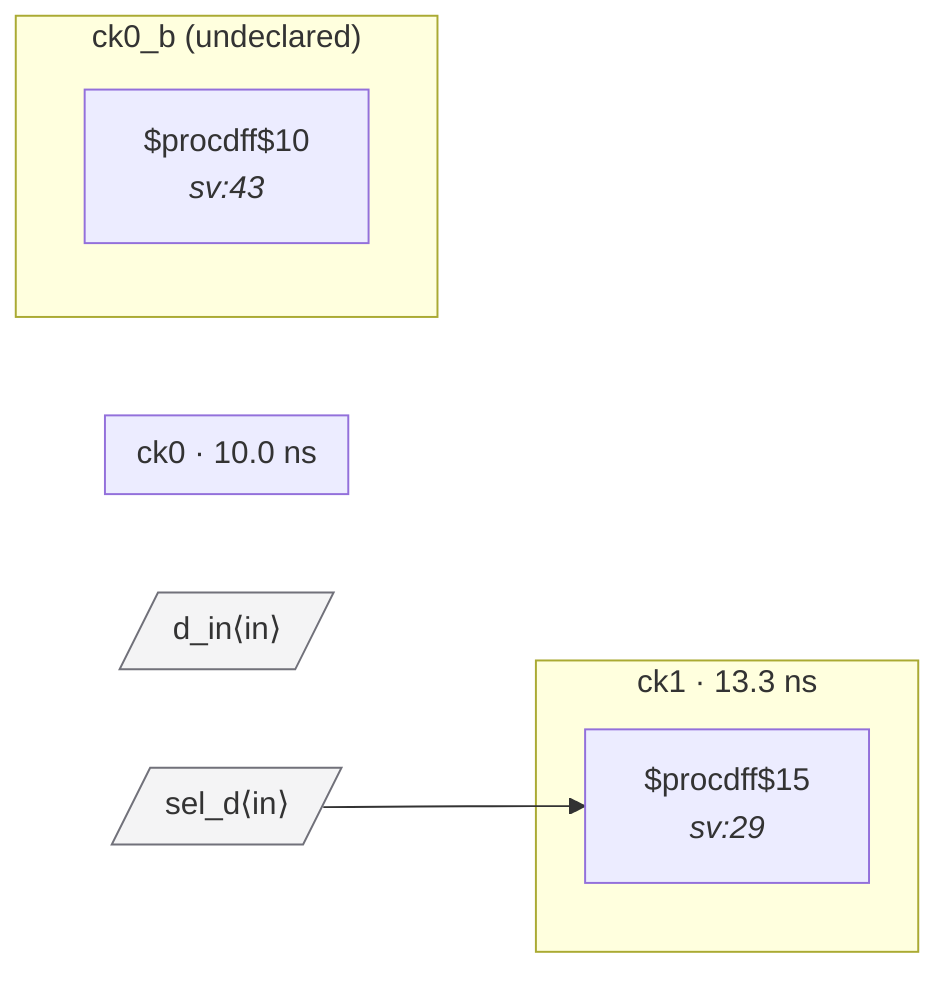

# Fixture: `bad_async_clock_mux`

<!-- generator: scripts/gen_fixture_docs.py -->

CDC-010 negative case — a clock mux whose select is driven by a flop in a foreign clock domain.

Without synchronization the select's transition (on a ck1 edge) chops the muxed output clock mid-cycle, producing a sub-period runt pulse that the downstream flop will sample as a real edge. Even with both mux inputs in the ck0 domain — same upstream source, only differing by which leg the user picked — the asynchronous select is unsafe: the analyzer fires structurally rather than try to prove input equivalence at the AC level.

Both ck0_a / ck0_b are declared as the same clock (`ck0`) in the SDC so the cell's clock-input-domain set collapses to `{ck0}`. `sel_q` sits in `ck1`, which is in a different async group than `ck0` — CDC-010 fires once on the `$mux`'s S pin.

- **Status:** negative — analyzer must report a violation
- **Top module:** `bad_async_clock_mux`
- **Clocks:** `ck0` (10.0 ns), `ck1` (13.3 ns)
- **Crossings:** 1 structural (0 async-per-SDC, 1 sync)

## Clock-domain map

## Files

- `bad_async_clock_mux.json`
- `bad_async_clock_mux.sdc`
- `bad_async_clock_mux.sv`

---
*Generated by `scripts/gen_fixture_docs.py` — re-run after editing the SV/SDC/netlist.*
