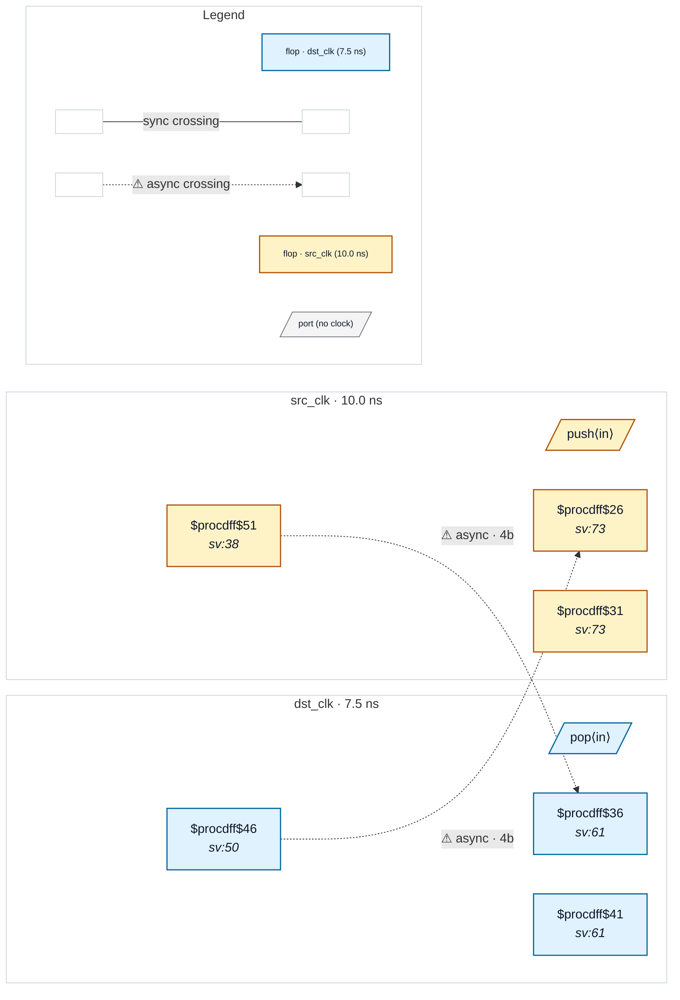

# Fixture: `bad_async_fifo_binary_ptrs`

<!-- generator: scripts/gen_fixture_docs.py -->

Negative counterpart to `good_async_fifo_gray_ptrs` (issue #170).

Same async-FIFO structure, but the wptr / rptr pointers are crossed in plain BINARY instead of Gray code. With multi-bit binary pointers crossing an async boundary, individual lanes can settle on different destination cycles — the dst-side sample can be a transient mix of the old and new pointer values that never existed as a real state. CDC-004 must fire on both crossings.

```text
This fixture exists to confirm that:
1. The pointer-pair shape (two opposite-direction multi-bit
   crossings) doesn't accidentally pass CDC-004 via some other
   exemption (gating, structural sync, etc.).
2. The good fixture's clean result is not trivial — the SAME
   structure with Gray dropped fails as expected.
```

- **Status:** negative — analyzer must report a violation
- **Top module:** `bad_async_fifo_binary_ptrs`
- **Clocks:** `dst_clk` (7.5 ns), `src_clk` (10.0 ns)
- **Crossings:** 2 structural (2 async-per-SDC, 0 sync)

## Clock-domain map



## Files

- `bad_async_fifo_binary_ptrs.json`
- `bad_async_fifo_binary_ptrs.sdc`
- `bad_async_fifo_binary_ptrs.sv`

---
*Generated by `scripts/gen_fixture_docs.py` — re-run after editing the SV/SDC/netlist.*
