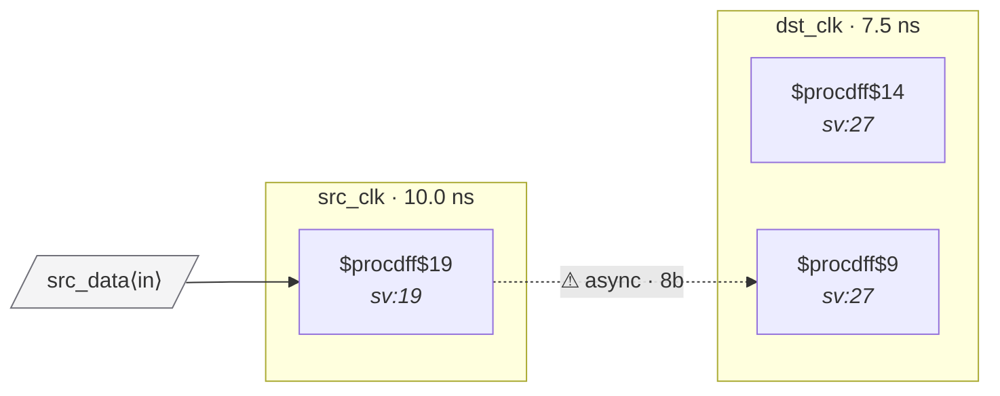

# Fixture: `bad_bus_crossing`

<!-- generator: scripts/gen_fixture_docs.py -->

Negative-case fixture: an 8-bit data bus crosses clock domains with no handshake, no gray-coding, and no gating. Each bit is independently metastable on the dst side, so even though every bit goes through a 2FF synchronizer the bus value as a whole can be sampled mid-flight (some bits old, some bits new). Should trip CDC-004.

- **Status:** negative — analyzer must report a violation
- **Top module:** `bad_bus_crossing`
- **Clocks:** `dst_clk` (7.5 ns), `src_clk` (10.0 ns)
- **Crossings:** 1 structural (1 async-per-SDC, 0 sync)

## Clock-domain map

## Files

- `bad_bus_crossing.json`
- `bad_bus_crossing.sdc`
- `bad_bus_crossing.sv`

---
*Generated by `scripts/gen_fixture_docs.py` — re-run after editing the SV/SDC/netlist.*
