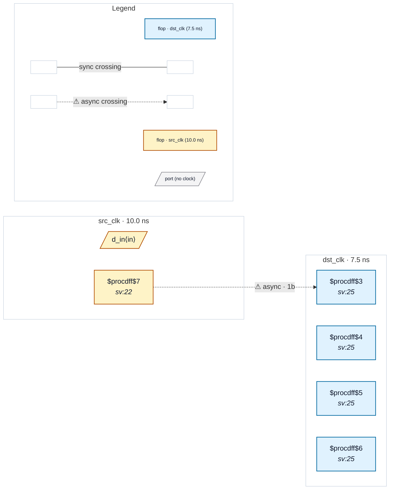

# Fixture: `bad_cascaded_synchroniser`

<!-- generator: scripts/gen_fixture_docs.py -->

Negative-case fixture for CDC-018.

A dst-domain sync chain whose depth (4 flops) exceeds the textbook 2FF minimum. The chain still works (extra latency, slightly worse MTBF tail), but the depth is a code-review smell — classically caused by two engineers each adding their own sync chain on the same wire, or a refactor that left the original chain in place when a new wrapper was added.

CDC-018 must fire once on the (src_q, dst_clk) group. CDC-001 / CDC-002 stay silent because the chain is structurally well-formed at depth >= required_depth.

- **Status:** negative — analyzer must report a violation
- **Top module:** `bad_cascaded_synchroniser`
- **Clocks:** `dst_clk` (7.5 ns), `src_clk` (10.0 ns)
- **Crossings:** 1 structural (1 async-per-SDC, 0 sync)

## Clock-domain map

## Files

- `bad_cascaded_synchroniser.json`
- `bad_cascaded_synchroniser.sdc`
- `bad_cascaded_synchroniser.sv`

---
*Generated by `scripts/gen_fixture_docs.py` — re-run after editing the SV/SDC/netlist.*
