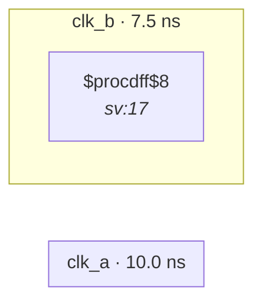

# Fixture: `bad_clock_as_data`

<!-- generator: scripts/gen_fixture_docs.py -->

Negative-case fixture: a clock signal is wired into a data input pin instead of a clock pin. Clocks live on dedicated low-skew networks; sampling one as data delivers the high-frequency edge toggle, breaks STA, and is almost always a wiring mistake. Should trip CDC-008.

- **Status:** negative — analyzer must report a violation
- **Top module:** `bad_clock_as_data`
- **Clocks:** `clk_a` (10.0 ns), `clk_b` (7.5 ns)
- **Crossings:** 0 structural (0 async-per-SDC, 0 sync)

## Clock-domain map

## Files

- `bad_clock_as_data.json`
- `bad_clock_as_data.sdc`
- `bad_clock_as_data.sv`

---
*Generated by `scripts/gen_fixture_docs.py` — re-run after editing the SV/SDC/netlist.*
