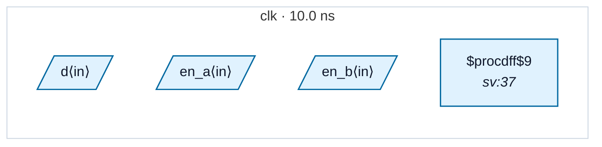

# Fixture: `bad_clock_gating`

<!-- generator: scripts/gen_fixture_docs.py -->

Negative-case fixture: a raw-AND clock gate driven by a combinational (un-registered) enable in the same clock domain.

Hazard: the AND output can glitch on any input transition, producing runt pulses on the gated clock. The downstream flop can clock at unintended moments.

This is a *synthesis-correctness* issue (use an ICG cell — a latch-then-AND structure that filters glitches), not a CDC one: no clock-domain crossing occurs. rtl-buddy-cdc is a CDC analyzer, so the rule pack stays silent here today. The paired test pins that behaviour; if the rule pack grows a glitch detector in the future, the test surfaces the change so coverage can be widened deliberately.

See issue #177.

- **Status:** negative — analyzer must report a violation
- **Top module:** `bad_clock_gating`
- **Clocks:** `clk` (10.0 ns)
- **Crossings:** 0 structural (0 async-per-SDC, 0 sync)

## Clock-domain map

## Files

- `bad_clock_gating.json`
- `bad_clock_gating.sdc`
- `bad_clock_gating.sv`

---
*Generated by `scripts/gen_fixture_docs.py` — re-run after editing the SV/SDC/netlist.*
