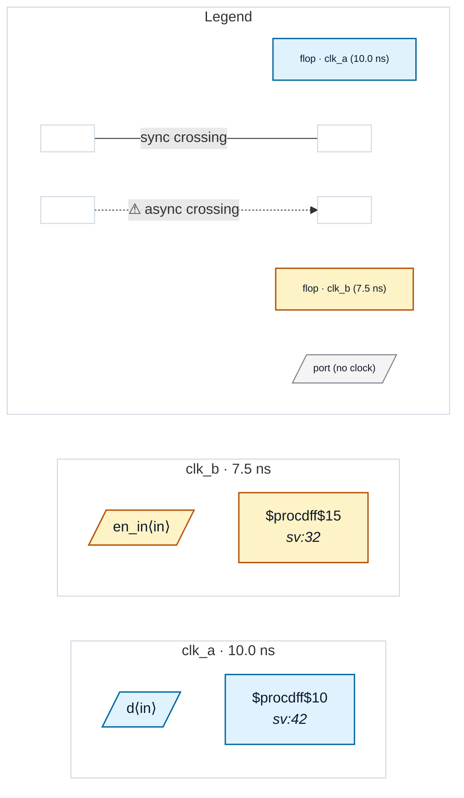

# Fixture: `bad_clock_gating_async_enable`

<!-- generator: scripts/gen_fixture_docs.py -->

Negative-case fixture: a raw-AND clock gate whose enable is a flop in a clock domain asynchronous to the gated clock.

Hazard: the enable transitions asynchronously to `clk_a`, so the AND output can chop the gated clock into runt pulses every time the enable changes. The downstream flop sees a clock with arbitrarily short high phases — every flop on this clock branch is at risk.

CDC-010 today targets named-control-pin cells ($mux.S, $dffe.EN, $dlatch.EN) and the pin-name heuristic for tech-mapped library cells (E / EN / CE / GATE / SE). A bare $and cell has none of those, so this hazard is currently invisible to the rule pack. The paired test pins that behaviour so future CDC-010 extensions (or a dedicated rule) can re-evaluate; if a rule starts firing here, the test signals the coverage expansion.

See issue #177.

- **Status:** negative — analyzer must report a violation
- **Top module:** `bad_clock_gating_async_enable`
- **Clocks:** `clk_a` (10.0 ns), `clk_b` (7.5 ns)
- **Crossings:** 0 structural (0 async-per-SDC, 0 sync)

## Clock-domain map

## Files

- `bad_clock_gating_async_enable.json`
- `bad_clock_gating_async_enable.sdc`
- `bad_clock_gating_async_enable.sv`

---
*Generated by `scripts/gen_fixture_docs.py` — re-run after editing the SV/SDC/netlist.*
