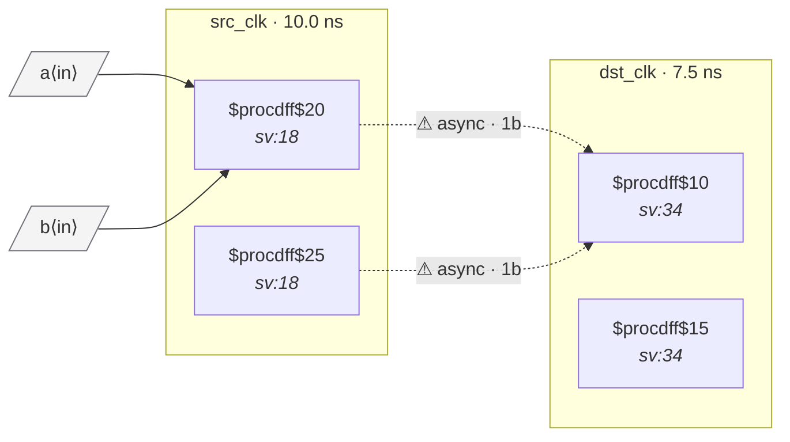

# Fixture: `bad_comb_before_sync`

<!-- generator: scripts/gen_fixture_docs.py -->

Negative-case fixture: combinational logic between source flops and the destination synchronizer's first stage. The two source flops can transition independently in src_clk, producing a glitch on the AND output that the 2FF synchronizer cannot reliably filter. Should trip CDC-003.

- **Status:** negative — analyzer must report a violation
- **Top module:** `bad_comb_before_sync`
- **Clocks:** `dst_clk` (7.5 ns), `src_clk` (10.0 ns)
- **Crossings:** 2 structural (2 async-per-SDC, 0 sync)

## Clock-domain map

## Files

- `bad_comb_before_sync.json`
- `bad_comb_before_sync.sdc`
- `bad_comb_before_sync.sv`

---
*Generated by `scripts/gen_fixture_docs.py` — re-run after editing the SV/SDC/netlist.*
