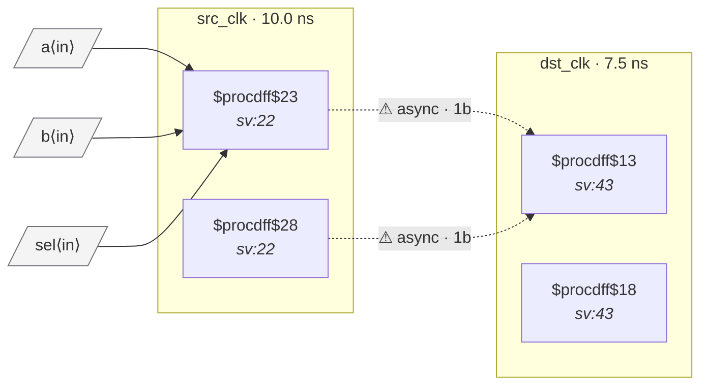

# Fixture: `bad_comb_before_sync_with_if`

<!-- generator: scripts/gen_fixture_docs.py -->

Negative-case fixture: the bad_comb_before_sync shape but written with an always_comb if/else instead of a continuous assign. Both source flops fan into the synchronizer first stage through the branch-selecting mux, so two CDC-003 violations should fire — one per source flop. The fixture exists primarily to drive the slang frontend's ConditionalStatement → $mux lowering (issue #36); the Yosys frontend also flattens this shape into a $mux post-proc, so it's a natural parity target.

- **Status:** negative — analyzer must report a violation
- **Top module:** `bad_comb_before_sync_with_if`
- **Clocks:** `dst_clk` (7.5 ns), `src_clk` (10.0 ns)
- **Crossings:** 3 structural (3 async-per-SDC, 0 sync)

## Clock-domain map

## Files

- `bad_comb_before_sync_with_if.json`
- `bad_comb_before_sync_with_if.sdc`
- `bad_comb_before_sync_with_if.sv`

---
*Generated by `scripts/gen_fixture_docs.py` — re-run after editing the SV/SDC/netlist.*
