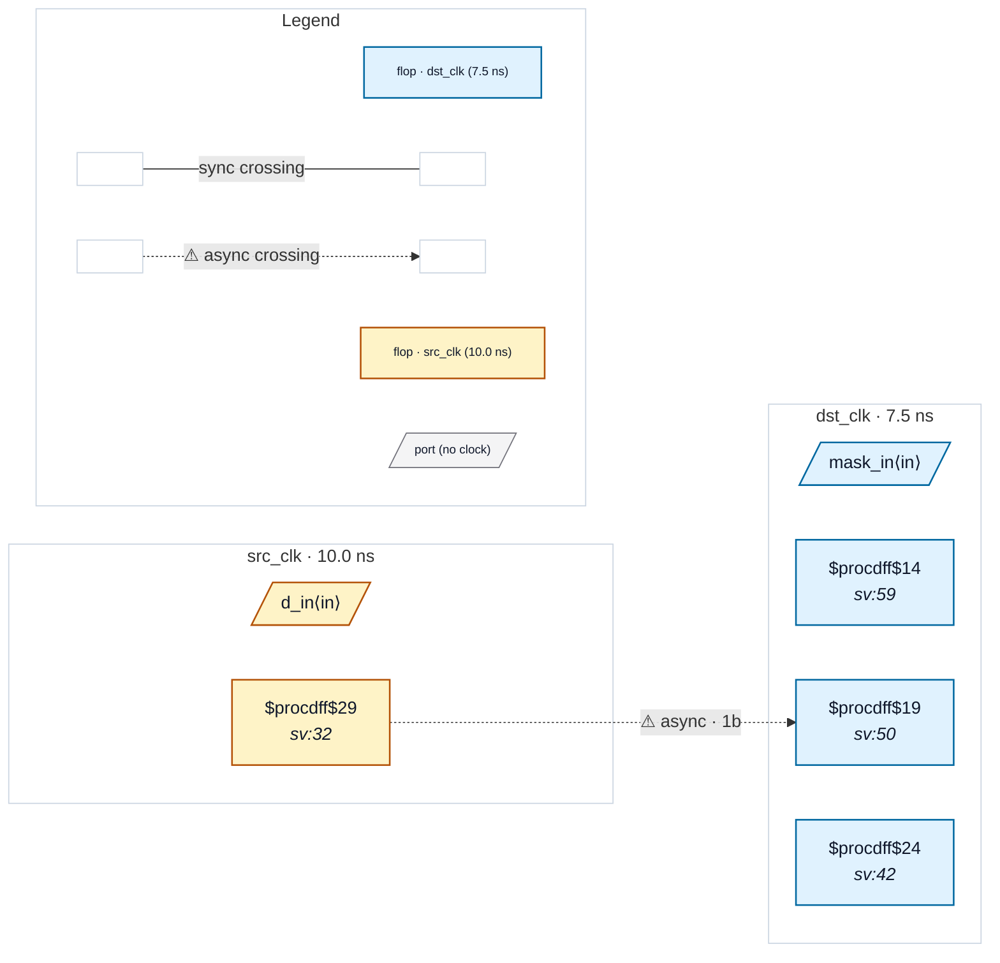

# Fixture: `bad_comb_between_sync_stages`

<!-- generator: scripts/gen_fixture_docs.py -->

Negative-case fixture for CDC-014 (issue #171): combinational logic *between* synchroniser stages.

The chain looks like a 2FF synchroniser at a glance, but stage 1's Q is gated by a comb cell before reaching stage 2's D:

```text
  src_q → sync_1 → (sync_1 & mask_q) → sync_2
```

The gate is the bug. stage_1 (`sync_1`) may still be metastable when the gate output is sampled by stage_2 on the next dst_clk edge, so the gate output can be a transient mix. The full clock period of resolution time the user thinks they bought is destroyed by the gate's propagation delay budget.

CDC-001 / CDC-002 see depth=1 (the chain walker terminates because sync_1's Q drives a comb cell, not a flop's D directly) — but a follow-on flop *does* exist behind the gate, so reporting "no second-stage synchronizer" would mislead the user. CDC-001 defers via `_chain_has_inter_stage_comb`, and CDC-014 fires with the correct framing.

- **Status:** negative — analyzer must report a violation
- **Top module:** `bad_comb_between_sync_stages`
- **Clocks:** `dst_clk` (7.5 ns), `src_clk` (10.0 ns)
- **Crossings:** 1 structural (1 async-per-SDC, 0 sync)

## Clock-domain map



## Files

- `bad_comb_between_sync_stages.json`
- `bad_comb_between_sync_stages.sdc`
- `bad_comb_between_sync_stages.sv`

---
*Generated by `scripts/gen_fixture_docs.py` — re-run after editing the SV/SDC/netlist.*
