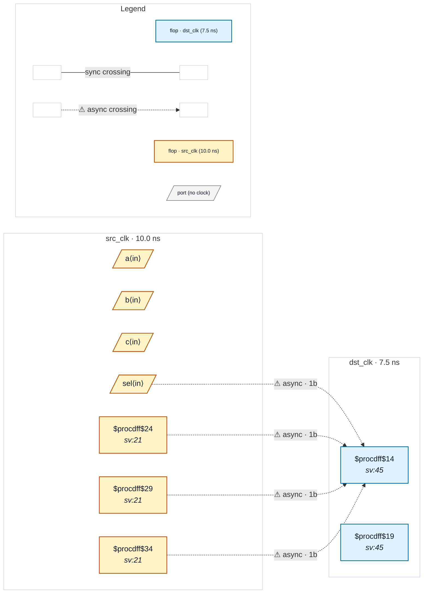

# Fixture: `bad_comb_case_before_sync`

<!-- generator: scripts/gen_fixture_docs.py -->

Negative-case fixture: the bad_comb_before_sync shape but written with an always_comb case instead of a continuous assign. Multiple source flops fan into the synchronizer first stage through a case-mux chain, so CDC-003 should fire — one violation per source flop that reaches the sync cone. Drives the slang frontend's CaseStatement → chained-$mux lowering (issue #37).

- **Status:** negative — analyzer must report a violation
- **Top module:** `bad_comb_case_before_sync`
- **Clocks:** `dst_clk` (7.5 ns), `src_clk` (10.0 ns)
- **Crossings:** 4 structural (4 async-per-SDC, 0 sync)

## Clock-domain map

## Files

- `bad_comb_case_before_sync.json`
- `bad_comb_case_before_sync.sdc`
- `bad_comb_case_before_sync.sv`

---
*Generated by `scripts/gen_fixture_docs.py` — re-run after editing the SV/SDC/netlist.*
