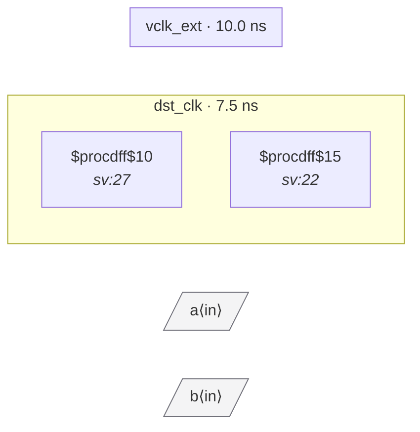

# Fixture: `bad_comb_source`

<!-- generator: scripts/gen_fixture_docs.py -->

Negative-case fixture: a synchronizer first stage in dst_clk is fed by combinational logic of top-level inputs, with no source-domain flop registering the value. Even though dst_clk has a 2FF chain to filter metastability, the unregistered comb source can glitch (during simultaneous transitions of `a` and `b`), and the sync may sample a transient value that never represented a stable input state. Should trip CDC-006.

- **Status:** negative — analyzer must report a violation
- **Top module:** `bad_comb_source`
- **Clocks:** `dst_clk` (7.5 ns), `vclk_ext` (10.0 ns)
- **Crossings:** 2 structural (2 async-per-SDC, 0 sync)

## Clock-domain map

## Files

- `bad_comb_source.json`
- `bad_comb_source.sdc`
- `bad_comb_source.sv`

---
*Generated by `scripts/gen_fixture_docs.py` — re-run after editing the SV/SDC/netlist.*
