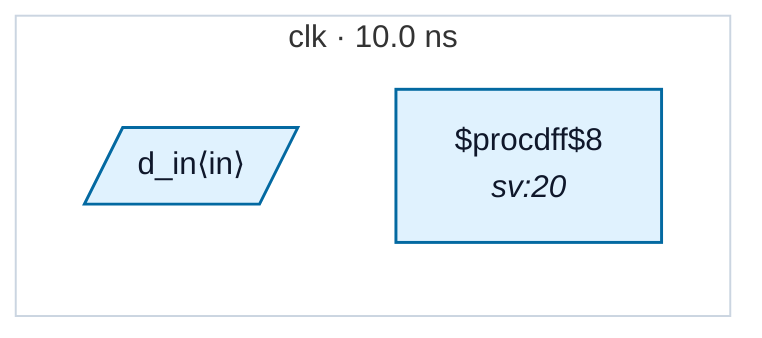

# Fixture: `bad_derived_async_reset_unsync`

<!-- generator: scripts/gen_fixture_docs.py -->

Negative fixture for derived async reset deassertion.

The reset source is selected intentionally by a mux, but the selected reset feeds a flop's asynchronous clear pin directly. The consumer clock has no local reset synchronizer, so reset deassertion can occur asynchronously relative to clk.

- **Status:** negative — analyzer must report a violation
- **Top module:** `bad_derived_async_reset_unsync`
- **Clocks:** `clk` (10.0 ns)
- **Crossings:** 0 structural (0 async-per-SDC, 0 sync)

## Clock-domain map

## Files

- `bad_derived_async_reset_unsync.json`
- `bad_derived_async_reset_unsync.sdc`
- `bad_derived_async_reset_unsync.sv`

---
*Generated by `scripts/gen_fixture_docs.py` — re-run after editing the SV/SDC/netlist.*
