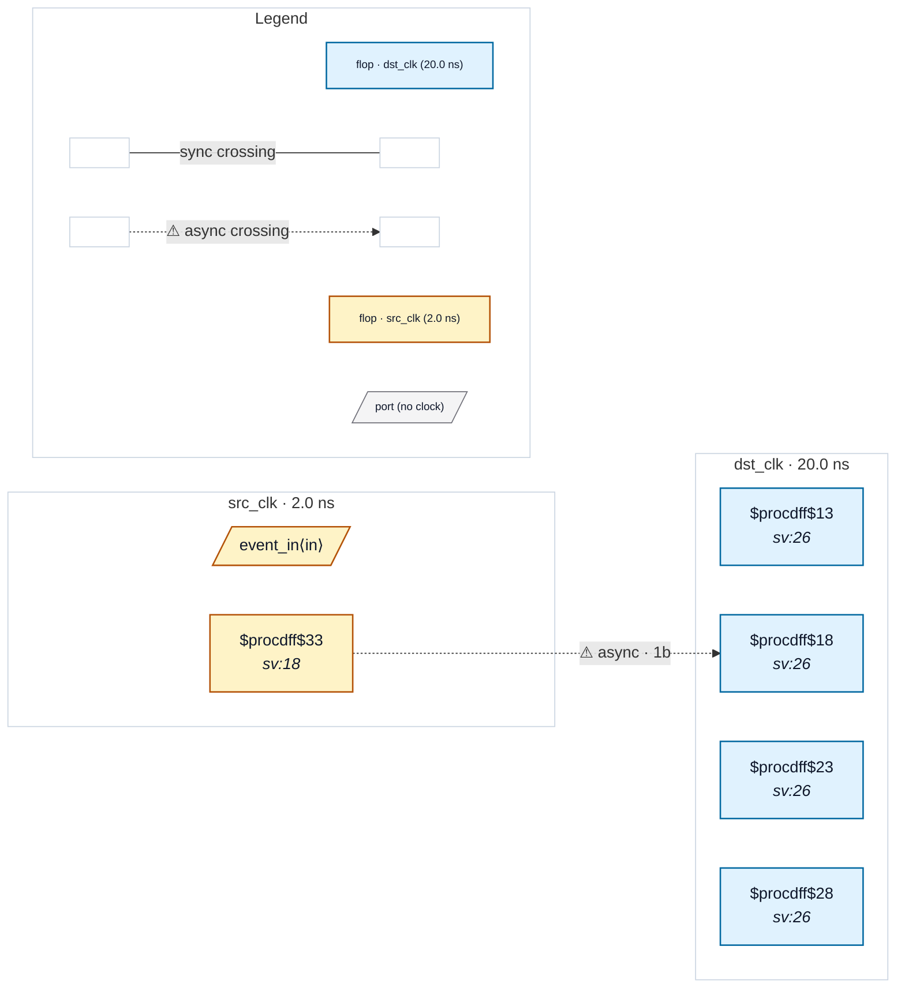

# Fixture: `bad_fast_to_slow_control_loss`

<!-- generator: scripts/gen_fixture_docs.py -->

Negative fixture for fast-to-slow control-event loss.

A fast source-domain event toggles a level that is sampled by a conventional 2FF synchronizer in a slower destination domain. If two events occur between destination samples, the toggle returns to its prior value and the destination loses both events. This is not a metastability failure; it is an event-accounting/protocol failure.

- **Status:** negative — analyzer must report a violation
- **Top module:** `bad_fast_to_slow_control_loss`
- **Clocks:** `dst_clk` (20.0 ns), `src_clk` (2.0 ns)
- **Crossings:** 1 structural (1 async-per-SDC, 0 sync)

## Clock-domain map

## Files

- `bad_fast_to_slow_control_loss.json`
- `bad_fast_to_slow_control_loss.sdc`
- `bad_fast_to_slow_control_loss.sv`

---
*Generated by `scripts/gen_fixture_docs.py` — re-run after editing the SV/SDC/netlist.*
