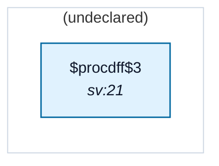

# Fixture: `bad_flop_clk_undeclared_port`

<!-- generator: scripts/gen_fixture_docs.py -->

Negative-case fixture for CDC-021.

A top-level input port (clk_aux) drives a flop's CLK pin but has no create_clock declaration in the SDC. The analyzer silently accepts the port name as the flop's clock domain — but `are_async` returns False against every declared clock (no async-group entry), so `_filter_async` drops every crossing involving the undeclared domain and the rule pack stays silent on flops in that domain.

CDC-021 must fire once on the (clk_aux, [q_aux]) pair. No other rule fires — there's no data port, no cross-domain crossing, and the toggle is self-contained.

- **Status:** negative — analyzer must report a violation
- **Top module:** `bad_flop_clk_undeclared_port`
- **Clocks:** _(none declared)_
- **Crossings:** 0 structural (0 async-per-SDC, 0 sync)

## Clock-domain map

## Files

- `bad_flop_clk_undeclared_port.json`
- `bad_flop_clk_undeclared_port.sdc`
- `bad_flop_clk_undeclared_port.sv`

---
*Generated by `scripts/gen_fixture_docs.py` — re-run after editing the SV/SDC/netlist.*
