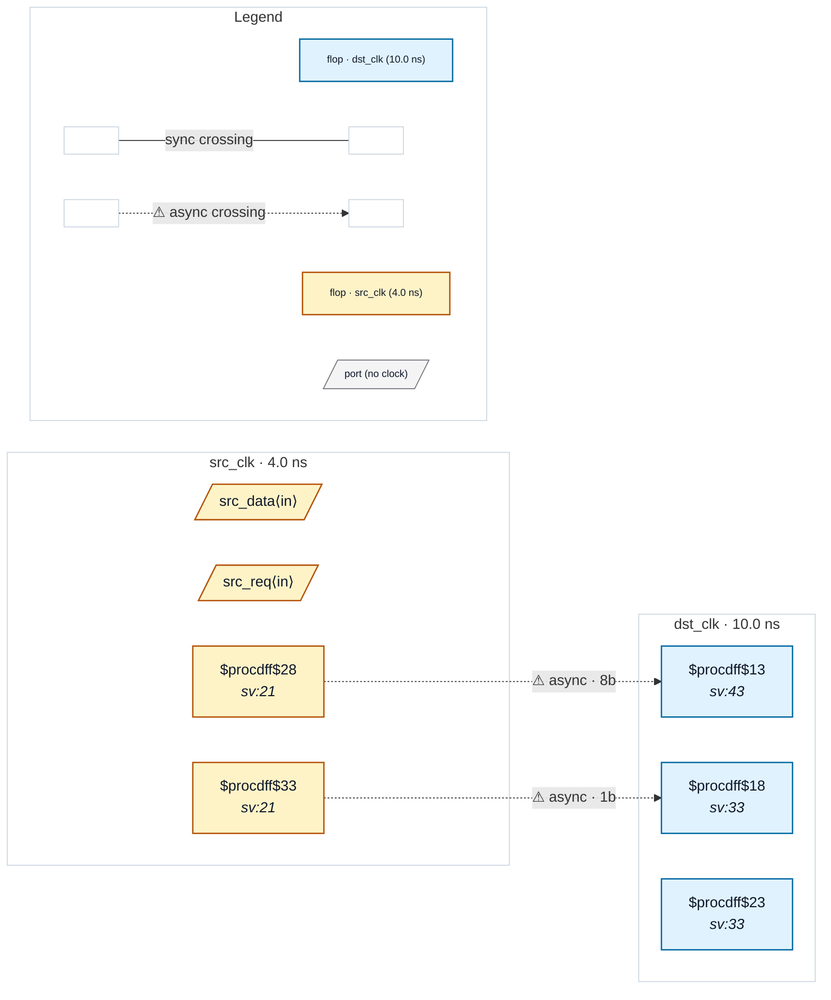

# Fixture: `bad_functional_datahold_enable`

<!-- generator: scripts/gen_fixture_docs.py -->

Negative fixture for functional data-enable stability.

The load request is synchronized into dst_clk before it controls the destination bus capture, so the crossing looks structurally gated. However, src_payload continues changing every src_clk cycle while the request travels through the synchronizer. A destination sample can therefore observe a different payload from the one associated with the original request.

- **Status:** negative — analyzer must report a violation
- **Top module:** `bad_functional_datahold_enable`
- **Clocks:** `dst_clk` (10.0 ns), `src_clk` (4.0 ns)
- **Crossings:** 2 structural (2 async-per-SDC, 0 sync)

## Clock-domain map

## Files

- `bad_functional_datahold_enable.json`
- `bad_functional_datahold_enable.sdc`
- `bad_functional_datahold_enable.sv`

---
*Generated by `scripts/gen_fixture_docs.py` — re-run after editing the SV/SDC/netlist.*
