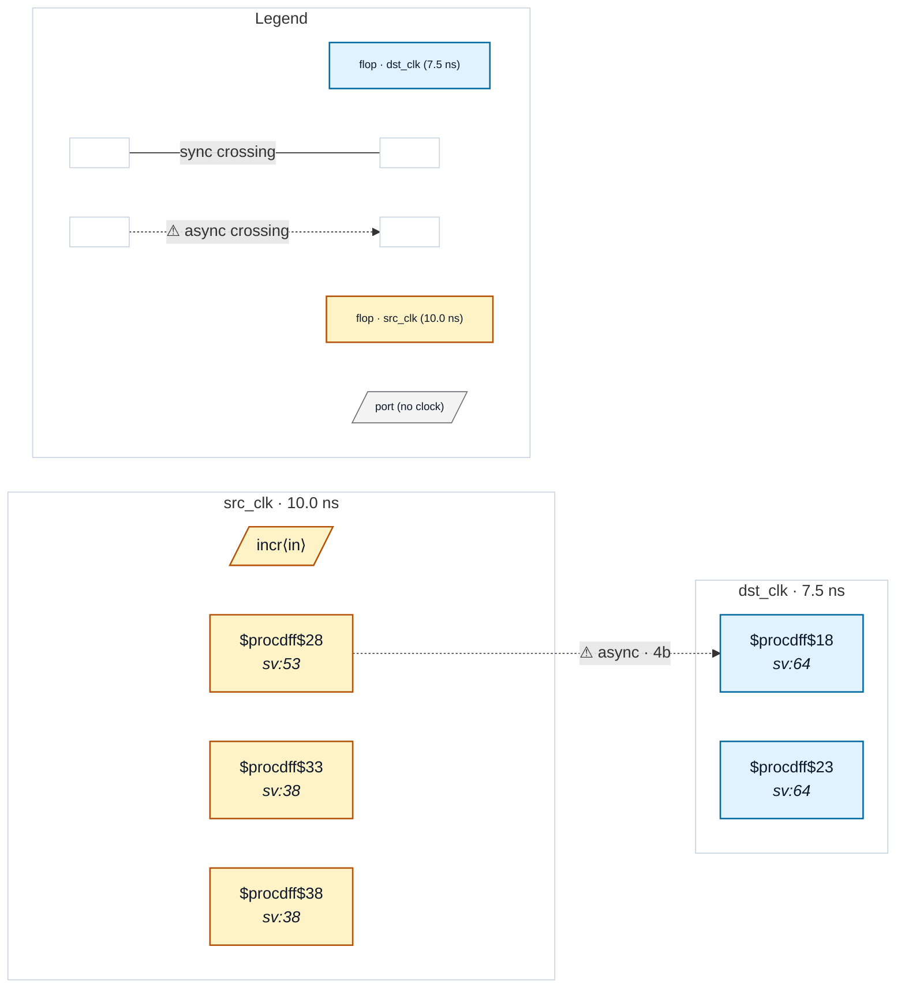

# Fixture: `bad_gray_phase_break`

<!-- generator: scripts/gen_fixture_docs.py -->

Anti-pattern fixture (issue #174): a Gray-coded value is re- registered in the source clock domain *before* being crossed.

Gray's load-bearing invariant is that at most one bit flips per source cycle. The intermediate re-register breaks it: at any destination sample point, `gray2_q` can hold the previous Gray value while `gray_q` already holds the next — a downstream sync chain reading `gray2_q` sees a multi-bit transition mid-flight, exactly what the encoding was supposed to prevent.

The crossing flop is `gray2_q`, not `gray_q`. The gray-encoding structural detector in rules.py walks back from `gray2_q.D`, hits the producer's Q-pin (a flop boundary), and stops without finding the canonical `b ^ (b >> 1)` XOR shape. Therefore the crossing is not exempted via the structural gray path, and CDC-004 must fire.

This fixture pins that detector behaviour as a regression sentinel: future tightening (or any change that walks across an intermediate flop) would surface here.

- **Status:** negative — analyzer must report a violation
- **Top module:** `bad_gray_phase_break`
- **Clocks:** `dst_clk` (7.5 ns), `src_clk` (10.0 ns)
- **Crossings:** 1 structural (1 async-per-SDC, 0 sync)

## Clock-domain map

## Files

- `bad_gray_phase_break.json`
- `bad_gray_phase_break.sdc`
- `bad_gray_phase_break.sv`

---
*Generated by `scripts/gen_fixture_docs.py` — re-run after editing the SV/SDC/netlist.*
