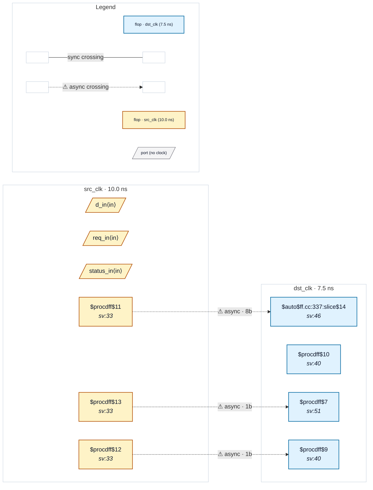

# Fixture: `bad_handshake_ack_missing`

<!-- generator: scripts/gen_fixture_docs.py -->

Negative-case fixture for G-5 (handshake reporter refinement, rtl-buddy-cdc#214).

```text
Two distinct findings on the same async domain pair:
  1. CDC-012 fires on the gated multi-bit src→dst bus crossing
     (no synced-back ack between the two domains).
  2. CDC-001 fires on a separate unsynced single-bit src→dst
     crossing (status_q in dst_clk samples status_src_q directly
     without a 2FF sync chain).
```

Today the user sees these as unrelated findings; the G-5 reporter refinement adds a "[handshake-related]" tag to the CDC-001 message pointing at the CDC-012 partner so the missing-ack relationship is visible without manual correlation.

Build: standard `proc; opt_dff; flatten;` — opt_dff coerces the gated assignment into $dffe (matching CDC-004's shape-1 detector and CDC-012's gated-bus precondition).

- **Status:** negative — analyzer must report a violation
- **Top module:** `bad_handshake_ack_missing`
- **Clocks:** `dst_clk` (7.5 ns), `src_clk` (10.0 ns)
- **Crossings:** 3 structural (3 async-per-SDC, 0 sync)

## Clock-domain map



## Files

- `bad_handshake_ack_missing.json`
- `bad_handshake_ack_missing.sdc`
- `bad_handshake_ack_missing.sv`

---
*Generated by `scripts/gen_fixture_docs.py` — re-run after editing the SV/SDC/netlist.*
