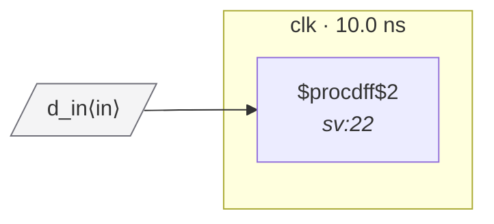

# Fixture: `bad_hints_reset_polarity`

<!-- generator: scripts/gen_fixture_docs.py -->

Negative-case fixture for the --reset-hints YAML path (issue #129).

Same shape as bad_marked_reset_polarity, but the (* reset_polarity *) SV attribute is intentionally absent — the port-declared polarity has to come from an external YAML hints file instead.

Without the hint, the analyzer has nothing to compare the flop's inferred ARST_POLARITY against (no producer flop, no clock-domain crossing). With the hint declaring rst_n as active-low, RDC-002 fires identically to the SV-attribute case.

- **Status:** negative — analyzer must report a violation
- **Top module:** `bad_hints_reset_polarity`
- **Clocks:** `clk` (10.0 ns)
- **Crossings:** 0 structural (0 async-per-SDC, 0 sync)

## Clock-domain map

## Files

- `bad_hints_reset_polarity.hints.yaml`
- `bad_hints_reset_polarity.json`
- `bad_hints_reset_polarity.sdc`
- `bad_hints_reset_polarity.sv`

---
*Generated by `scripts/gen_fixture_docs.py` — re-run after editing the SV/SDC/netlist.*
