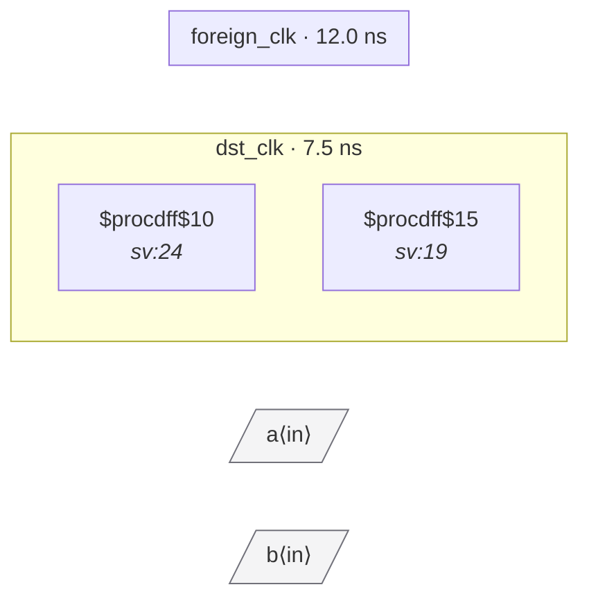

# Fixture: `bad_input_delay_cross_domain`

<!-- generator: scripts/gen_fixture_docs.py -->

Negative fixture: set_input_delay declares port `a` as being in foreign_clk's domain, and a 2FF synchronizer in dst_clk samples it through combinational logic. The SDC explicitly says these clocks are async, so the synchronizer is reading a cross-domain comb signal — must trip CDC-006 (with the source clock named in the message, since both ends are typed).

- **Status:** negative — analyzer must report a violation
- **Top module:** `bad_input_delay_cross_domain`
- **Clocks:** `dst_clk` (7.5 ns), `foreign_clk` (12.0 ns)
- **Crossings:** 2 structural (2 async-per-SDC, 0 sync)

## Clock-domain map

## Files

- `bad_input_delay_cross_domain.json`
- `bad_input_delay_cross_domain.sdc`
- `bad_input_delay_cross_domain.sv`

---
*Generated by `scripts/gen_fixture_docs.py` — re-run after editing the SV/SDC/netlist.*
