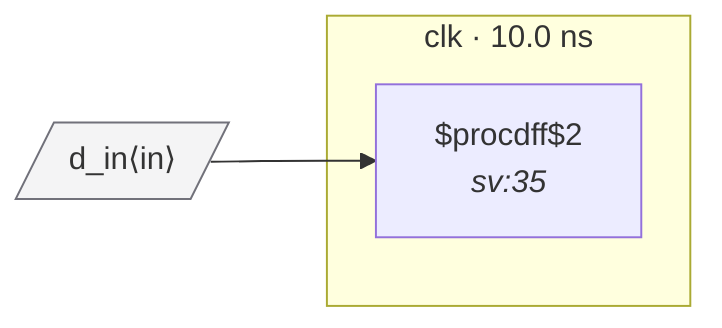

# Fixture: `bad_marked_reset_polarity`

<!-- generator: scripts/gen_fixture_docs.py -->

Negative-case fixture for RDC-002's port-declared-polarity variant (issue #107).

The top-level port `rst_n` is annotated with `(* reset_polarity = "low" *)` — the designer is asserting this is an active-low signal. The flop `bad_q`, however, is wired `posedge rst_n`, so Yosys infers ARST_POLARITY=1 (active-high reset). The two disagree:

```text
  port-declared polarity  = low  (asserts on '0')
  flop ARST_POLARITY       = 1   (asserts on '1')
```

The flop will reset on the rising edge of rst_n — the moment the rest of the design comes out of reset. This is the classic "posedge on the active-low port" wiring bug.

Without the port attribute the analyzer has no way to flag this (the flop is wired directly to a port, no producer flop to compare against, no clock-domain crossing). The attribute is what distinguishes "designer mistake" from "designer intent".

- **Status:** negative — analyzer must report a violation
- **Top module:** `bad_marked_reset_polarity`
- **Clocks:** `clk` (10.0 ns)
- **Crossings:** 0 structural (0 async-per-SDC, 0 sync)

## Clock-domain map



## Files

- `bad_marked_reset_polarity.json`
- `bad_marked_reset_polarity.reset-domain-map.json`
- `bad_marked_reset_polarity.sdc`
- `bad_marked_reset_polarity.sv`

---
*Generated by `scripts/gen_fixture_docs.py` — re-run after editing the SV/SDC/netlist.*
