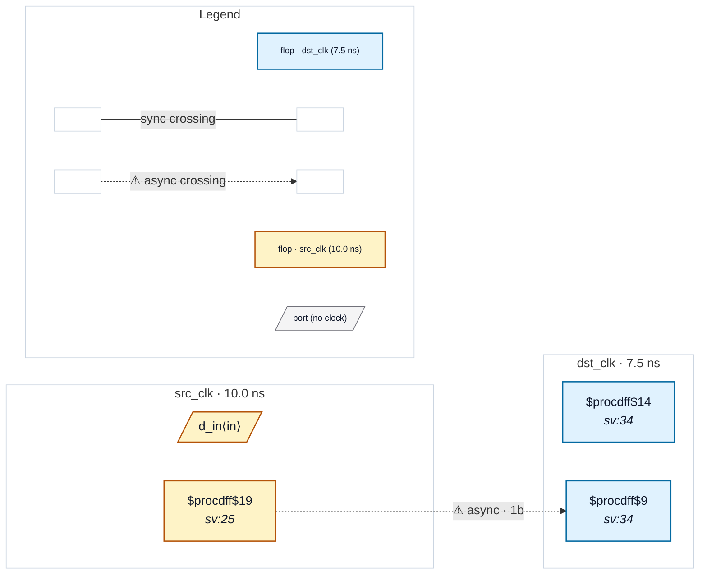

# Fixture: `bad_marked_user_sync_wrong_stage`

<!-- generator: scripts/gen_fixture_docs.py -->

Trust-boundary sentinel (issue #178): `(* cdc_sync *)` placed on stage 2 of a 2FF chain instead of stage 1 (the head / first destination flop of the crossing).

At the default `--sync-depth 2` this fixture passes trivially — the chain is structurally clean and no rule fires either way. To expose the trust-scope question we run the rule pack with `required_depth=3`: a depth-2 chain is now insufficient and CDC-002 should fire on the head (stage 1). The attribute on stage 2 is the *wrong flop* — suppression is dst-flop-keyed (the crossing's destination is stage 1), so CDC-002 must still fire.

Pins the contract that `(* cdc_sync *)` annotates one specific flop and does not retroactively whitelist the entire chain.

- **Status:** negative — analyzer must report a violation
- **Top module:** `bad_marked_user_sync_wrong_stage`
- **Clocks:** `dst_clk` (7.5 ns), `src_clk` (10.0 ns)
- **Crossings:** 1 structural (1 async-per-SDC, 0 sync)

## Clock-domain map

## Files

- `bad_marked_user_sync_wrong_stage.json`
- `bad_marked_user_sync_wrong_stage.sdc`
- `bad_marked_user_sync_wrong_stage.sv`

---
*Generated by `scripts/gen_fixture_docs.py` — re-run after editing the SV/SDC/netlist.*
