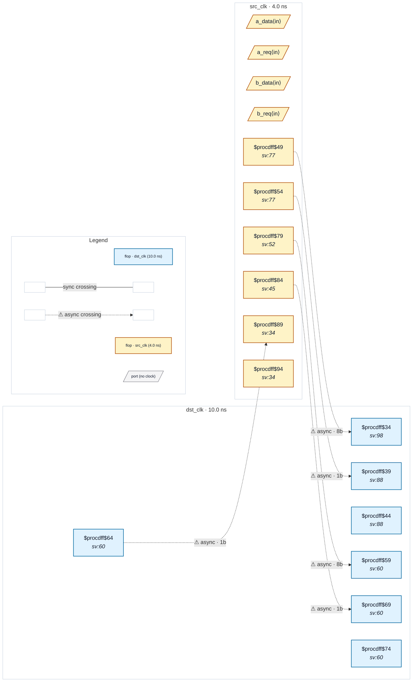

# Fixture: `bad_mixed_handshake_datahold`

<!-- generator: scripts/gen_fixture_docs.py -->

CDC-012 — feedback presence is a crossing-level property, not a domain-level one (rtl-buddy-cdc#239).

Two independent multi-bit gated-bus crossings share the same src_clk -> dst_clk async pair:

```text
  * Channel A (a_*) is a textbook req/ack handshake — the source
    holds a_payload until a synced-back ack (a_ack_sync) proves the
    destination sampled. CDC-012 must stay SILENT on it.
  * Channel B (b_*) is the broken req-only form — b_payload advances
    every src_clk while the request crosses, with no ack feedback.
    CDC-012 must FIRE on it.
```

The bug this guards against: a feedback cache keyed on the (src_clk, dst_clk) domain pair would see channel A's ack feedback and silence channel B too. The fix scopes the feedback check to each crossing's own source flop, so the broken channel still fires.

- **Status:** negative — analyzer must report a violation
- **Top module:** `bad_mixed_handshake_datahold`
- **Clocks:** `dst_clk` (10.0 ns), `src_clk` (4.0 ns)
- **Crossings:** 5 structural (5 async-per-SDC, 0 sync)

## Clock-domain map



## Files

- `bad_mixed_handshake_datahold.json`
- `bad_mixed_handshake_datahold.sdc`
- `bad_mixed_handshake_datahold.sv`

---
*Generated by `scripts/gen_fixture_docs.py` — re-run after editing the SV/SDC/netlist.*
