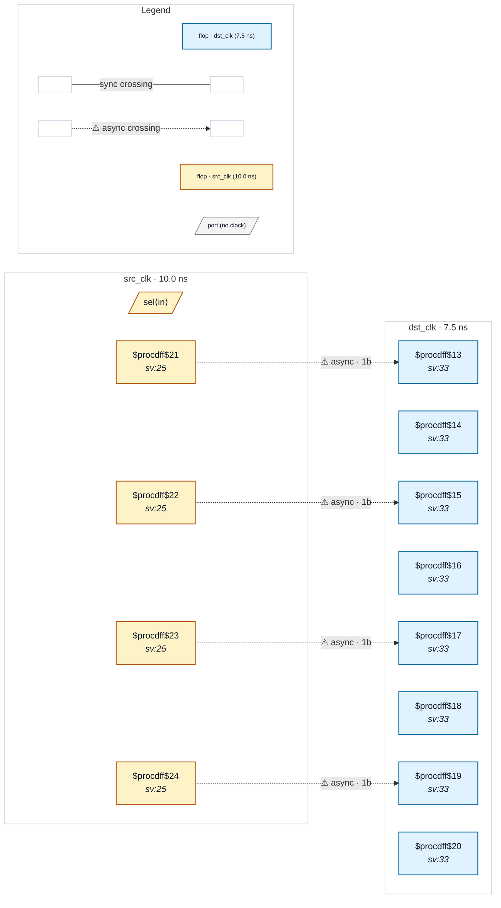

# Fixture: `bad_onehot_decode_independent_sync`

<!-- generator: scripts/gen_fixture_docs.py -->

Negative-case fixture for CDC-019.

A 2-to-4 one-hot decoder generates four parallel 1-bit signals. Each is registered separately in the source domain, then sent through its own independent 2FF synchroniser in the destination domain. CDC-004 doesn't fire because each registering flop is structurally 1-bit — but the lanes are related upstream in the shared decoder, and the destination can observe transient combinations the encoder never emits.

- **Status:** negative — analyzer must report a violation
- **Top module:** `bad_onehot_decode_independent_sync`
- **Clocks:** `dst_clk` (7.5 ns), `src_clk` (10.0 ns)
- **Crossings:** 4 structural (4 async-per-SDC, 0 sync)

## Clock-domain map

## Files

- `bad_onehot_decode_independent_sync.json`
- `bad_onehot_decode_independent_sync.sdc`
- `bad_onehot_decode_independent_sync.sv`

---
*Generated by `scripts/gen_fixture_docs.py` — re-run after editing the SV/SDC/netlist.*
