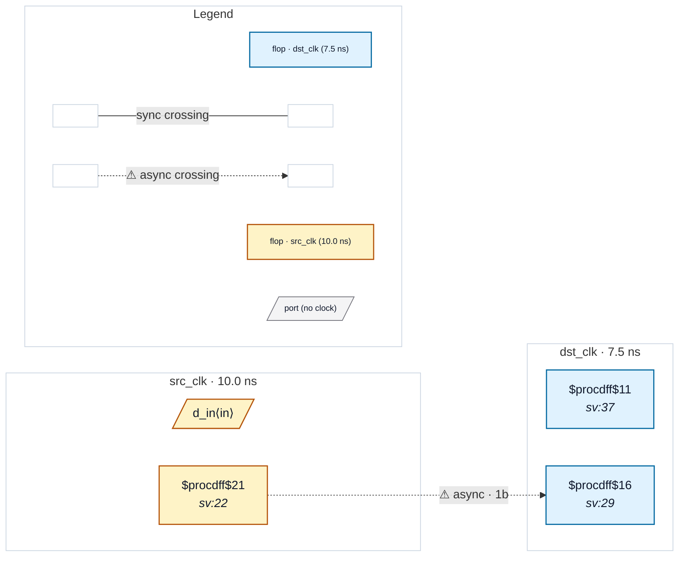

# Fixture: `bad_opposite_edge_sync`

<!-- generator: scripts/gen_fixture_docs.py -->

Negative-case fixture for CDC-016 (issue #175): an opposite-edge synchroniser. The first stage samples on the positive edge of `dst_clk`; the second stage on the negative edge of the same clock. Each metastable value has only half a clock period to resolve instead of a full period — MTBF is roughly halved.

The RTL looks syntactically symmetric (2FF on `dst_clk`), and the structural depth check (CDC-001 / CDC-002) sees a valid chain at depth 2 — both rules stay silent. CDC-016 fires by walking the chain via `_sync_chain_flops` and noticing that adjacent stages disagree on CLK_POLARITY.

- **Status:** negative — analyzer must report a violation
- **Top module:** `bad_opposite_edge_sync`
- **Clocks:** `dst_clk` (7.5 ns), `src_clk` (10.0 ns)
- **Crossings:** 1 structural (1 async-per-SDC, 0 sync)

## Clock-domain map

## Files

- `bad_opposite_edge_sync.json`
- `bad_opposite_edge_sync.sdc`
- `bad_opposite_edge_sync.sv`

---
*Generated by `scripts/gen_fixture_docs.py` — re-run after editing the SV/SDC/netlist.*
