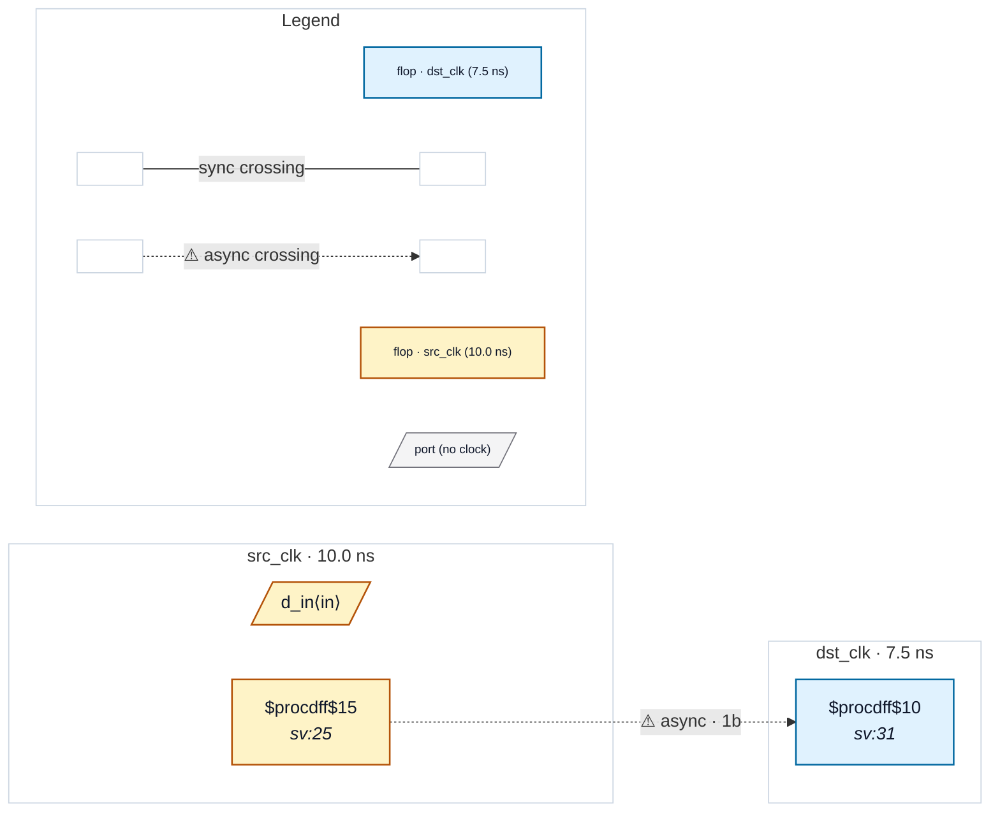

# Fixture: `bad_packed_first_stage_used`

<!-- generator: scripts/gen_fixture_docs.py -->

Adversarial counterpart to good_packed_shift_sync, pinning the reader-count guard in the packed-shift-register recognizer (#264).

The destination is again a 2-bit shifting register, but the *first* stage (`sync_sr[0]`) is consumed combinationally — the potentially metastable Q[0] is in use after a single destination flop. The effective synchronizer depth is therefore 1, and CDC-001 must still fire even though the register is multi-bit and self-shifting.

This is the over-suppression trap: the packed-shift fast path must not blanket-accept any self-shifting multi-bit flop as a deep synchronizer. The walk only extends a stage whose output feeds exactly the next shift lane (reader count == 1); tapping the first stage breaks that and the chain ends at depth 1.

- **Status:** negative — analyzer must report a violation
- **Top module:** `bad_packed_first_stage_used`
- **Clocks:** `dst_clk` (7.5 ns), `src_clk` (10.0 ns)
- **Crossings:** 1 structural (1 async-per-SDC, 0 sync)

## Clock-domain map

## Files

- `bad_packed_first_stage_used.json`
- `bad_packed_first_stage_used.sdc`
- `bad_packed_first_stage_used.sv`

---
*Generated by `scripts/gen_fixture_docs.py` — re-run after editing the SV/SDC/netlist.*
