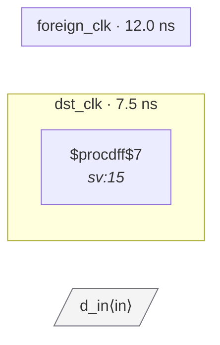

# Fixture: `bad_port_no_sync`

<!-- generator: scripts/gen_fixture_docs.py -->

Negative-case fixture: a top-level input port typed via set_input_delay -clock foreign_clk drives a flop in dst_clk directly, with no synchronizer chain. CDC-001 must fire on this port→flop crossing — the destination flop has chain depth 1 (just itself), and the SDC declares the two clocks async.

- **Status:** negative — analyzer must report a violation
- **Top module:** `bad_port_no_sync`
- **Clocks:** `dst_clk` (7.5 ns), `foreign_clk` (12.0 ns)
- **Crossings:** 1 structural (1 async-per-SDC, 0 sync)

## Clock-domain map

## Files

- `bad_port_no_sync.json`
- `bad_port_no_sync.sdc`
- `bad_port_no_sync.sv`

---
*Generated by `scripts/gen_fixture_docs.py` — re-run after editing the SV/SDC/netlist.*
