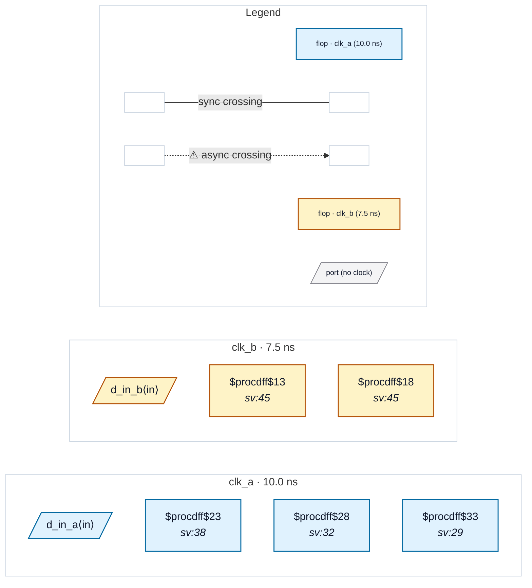

# Fixture: `bad_primary_reset_unsynced`

<!-- generator: scripts/gen_fixture_docs.py -->

Negative-case fixture for RDC-008.

A top-level reset port (raw_rst_n) drives flops in two clock domains. clk_a has a proper 2FF reset-synchroniser chain — the user clearly knows the port needs synchronisation. clk_b uses the raw port directly on ≥2 flops without any chain — the "forgot to add the chain in clk_b" methodology bug RDC-008 catches. Reset assertion is fine (combinational), but the deassertion edge is unsynchronised to clk_b — recovery/removal timing violations can leave the clk_b flops in different reset states.

RDC-001 stays silent because the reset source is a port (not a foreign-domain flop). RDC-008 must fire once on the (raw_rst_n, clk_b) group.

- **Status:** negative — analyzer must report a violation
- **Top module:** `bad_primary_reset_unsynced`
- **Clocks:** `clk_a` (10.0 ns), `clk_b` (7.5 ns)
- **Crossings:** 0 structural (0 async-per-SDC, 0 sync)

## Clock-domain map

## Files

- `bad_primary_reset_unsynced.json`
- `bad_primary_reset_unsynced.sdc`
- `bad_primary_reset_unsynced.sv`

---
*Generated by `scripts/gen_fixture_docs.py` — re-run after editing the SV/SDC/netlist.*
