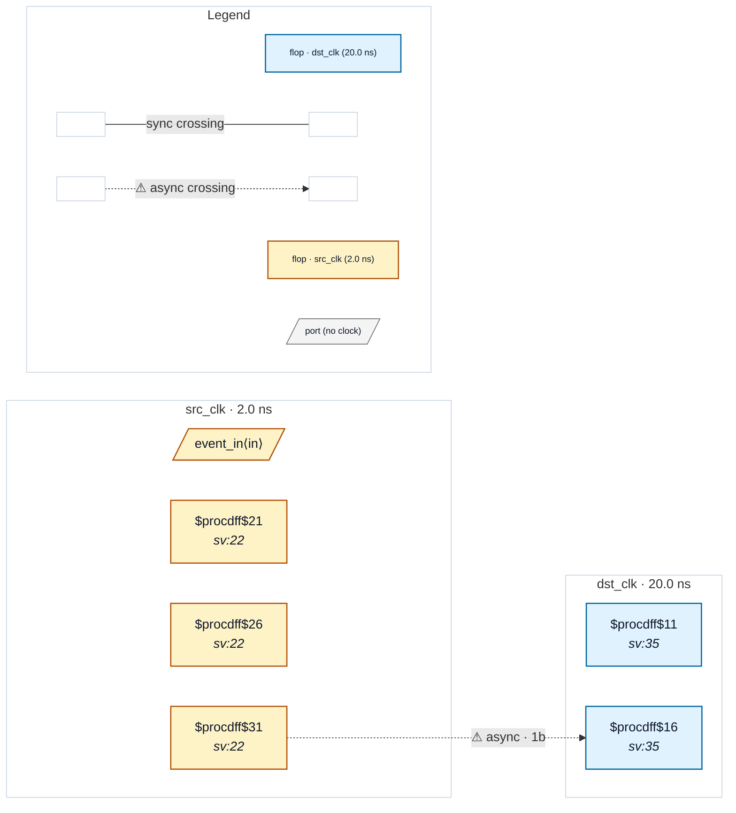

# Fixture: `bad_pulse_width_fast_to_slow`

<!-- generator: scripts/gen_fixture_docs.py -->

Negative-case fixture for CDC-009: a single-cycle src-domain pulse is sampled by a 10x-slower dst clock. The pulse may land entirely between two dst rising edges and be lost (data lost without metastability ever entering the picture). CDC-009 must fire.

Shape: event_q is the registered version of an external event; event_d is its 1-cycle delay; event_strobe = event_q & ~event_d is a 1-cycle pulse on event_q's rising edge. The pulse is sampled by the dst-clock 2FF sync chain — which is structurally sound for metastability (CDC-001/002 stay silent) but doesn't help with pulse-width loss. See issue #47.

- **Status:** negative — analyzer must report a violation
- **Top module:** `bad_pulse_width_fast_to_slow`
- **Clocks:** `dst_clk` (20.0 ns), `src_clk` (2.0 ns)
- **Crossings:** 1 structural (1 async-per-SDC, 0 sync)

## Clock-domain map

## Files

- `bad_pulse_width_fast_to_slow.json`
- `bad_pulse_width_fast_to_slow.sdc`
- `bad_pulse_width_fast_to_slow.sv`

---
*Generated by `scripts/gen_fixture_docs.py` — re-run after editing the SV/SDC/netlist.*
