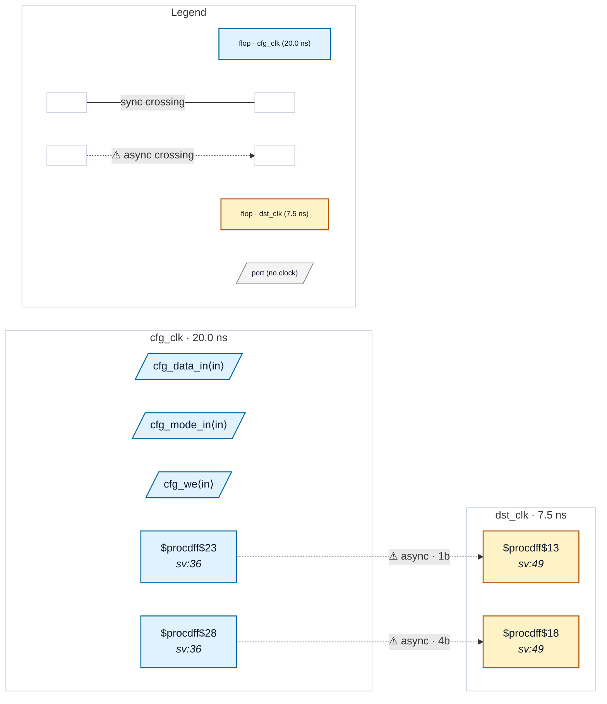

# Fixture: `bad_quasi_static_unmarked`

<!-- generator: scripts/gen_fixture_docs.py -->

Negative counterpart to `marked_quasi_static` (issue #173): structurally identical configuration-register pattern, but the `(* cdc_static *)` attribute has been omitted from both source flops.

Without the attribute the analyzer cannot tell a held-after-boot register apart from a routinely-toggling one — so it must treat the depth-1 single-bit crossing as CDC-001 and the ungated 4-bit bus crossing as CDC-004. The paired test pins both findings.

This fixture exists to confirm two things:

```text
1. The analyzer fires the expected rules in the absence of the
   attribute — i.e. the marked fixture's clean result is not
   accidentally trivial.
2. The marked fixture and this fixture are *the same RTL* modulo
   the annotation, so the attribute is doing exactly the work
   claimed.
```

- **Status:** negative — analyzer must report a violation
- **Top module:** `bad_quasi_static_unmarked`
- **Clocks:** `cfg_clk` (20.0 ns), `dst_clk` (7.5 ns)
- **Crossings:** 2 structural (2 async-per-SDC, 0 sync)

## Clock-domain map



## Files

- `bad_quasi_static_unmarked.json`
- `bad_quasi_static_unmarked.sdc`
- `bad_quasi_static_unmarked.sv`

---
*Generated by `scripts/gen_fixture_docs.py` — re-run after editing the SV/SDC/netlist.*
