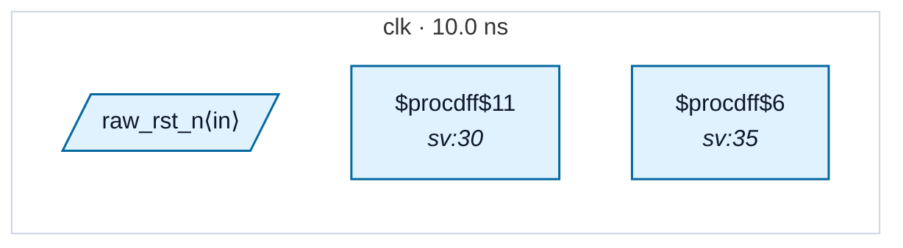

# Fixture: `bad_rdc_002_polarity_mismatch`

<!-- generator: scripts/gen_fixture_docs.py -->

Negative-case fixture for RDC-002 — reset polarity mismatch.

The producer flop `gated_rst` is `$adff` with ARST_POLARITY=0 (active-low reset) and ARST_VALUE=0 — so when raw_rst_n is asserted, gated_rst.Q goes to 0. Otherwise gated_rst.Q follows D=1.

The consumer flop `q_out` takes gated_rst as its async reset on a posedge: Yosys infers `$adff` with ARST_POLARITY=1 (active-high reset). RDC-002 fires because:

```text
  gated_rst.ARST_VALUE = 0   (Q during raw reset)
  q_out.ARST_POLARITY  = 1   (reset asserted on ARST=1)
```

When raw_rst_n drops (system reset), gated_rst.Q → 0, which is NOT the assert value q_out expects (=1). q_out NEVER enters reset during a system reset event — a polarity wiring bug.

Without RDC-002 this slips through every other rule in the pack (no clock crossing — both flops are on `clk` — and the direct flop→ARST connection passes RDC-001's same-domain check).

- **Status:** negative — analyzer must report a violation
- **Top module:** `bad_rdc_002_polarity_mismatch`
- **Clocks:** `clk` (10.0 ns)
- **Crossings:** 0 structural (0 async-per-SDC, 0 sync)

## Clock-domain map



## Files

- `bad_rdc_002_polarity_mismatch.json`
- `bad_rdc_002_polarity_mismatch.sdc`
- `bad_rdc_002_polarity_mismatch.sv`

---
*Generated by `scripts/gen_fixture_docs.py` — re-run after editing the SV/SDC/netlist.*
