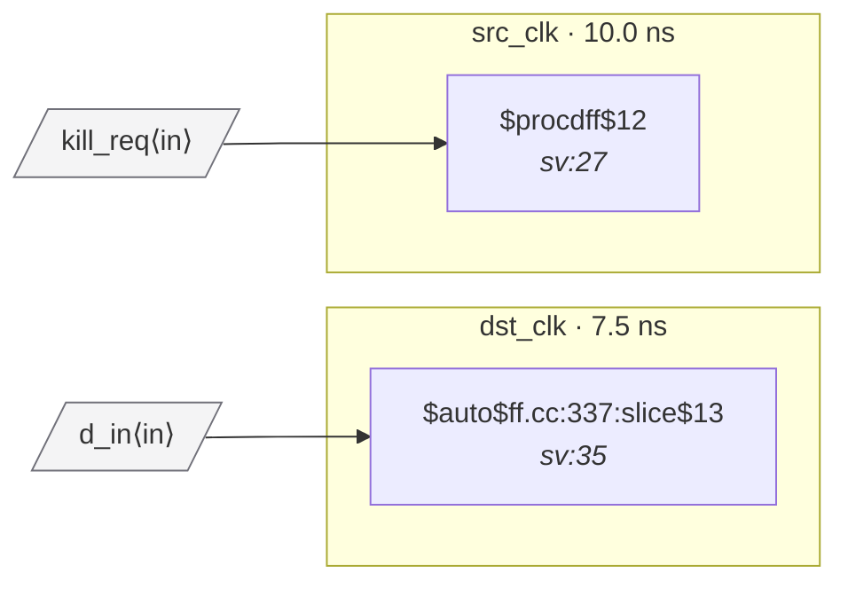

# Fixture: `bad_rdc_003_sync_reset_crossing`

<!-- generator: scripts/gen_fixture_docs.py -->

Negative-case fixture for RDC-003 — sync reset crossing without a reset synchroniser.

`src_rst` is registered in `src_clk` and used directly as the **synchronous** reset (`SRST`) of `q_dst` in `dst_clk`. Sync resets are sampled on the destination clock's edge — if the upstream signal lives in a foreign async clock domain, the sample may be metastable on the cycle the source flop changes.

The classic fix is a 2FF reset synchroniser in `dst_clk` between `src_rst` and the consuming flop. The paired `good_*` counterpart shows it.

RDC-003 must fire once on `q_dst`; no other rule should fire (q_dst's D = a port, so no data crossing).

```text
Build:
  yosys -p 'read_verilog -sv bad_rdc_003_sync_reset_crossing.sv;
            hierarchy -top bad_rdc_003_sync_reset_crossing;
            proc; opt_dff; flatten; opt_clean;
            write_json bad_rdc_003_sync_reset_crossing.json'
```

`opt_dff` is required to fold the mux-on-D shape into `$sdff` — without it the consumer is a plain `$dff` with a `$mux` selecting between `1'b0` and `d_in` based on `src_rst`, and RDC-003 (which keys on the `SRST` pin) cannot recognise the sync-reset path.

- **Status:** negative — analyzer must report a violation
- **Top module:** `bad_rdc_003_sync_reset_crossing`
- **Clocks:** `dst_clk` (7.5 ns), `src_clk` (10.0 ns)
- **Crossings:** 0 structural (0 async-per-SDC, 0 sync)

## Clock-domain map



## Files

- `bad_rdc_003_sync_reset_crossing.json`
- `bad_rdc_003_sync_reset_crossing.sdc`
- `bad_rdc_003_sync_reset_crossing.sv`

---
*Generated by `scripts/gen_fixture_docs.py` — re-run after editing the SV/SDC/netlist.*
