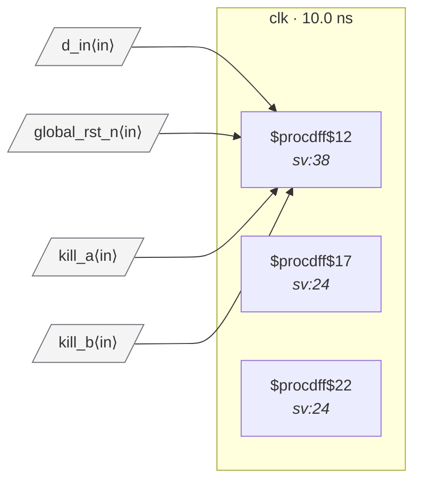

# Fixture: `bad_rdc_004_comb_driven_reset`

<!-- generator: scripts/gen_fixture_docs.py -->

Negative-case fixture for RDC-004 — reset pin driven by combinational logic with no synchroniser in the path.

Two flops produce per-channel kill signals; the consumer's ARST is wired to the AND of both Q outputs. Comb-gate outputs can glitch when the inputs transition near-simultaneously — the transient appears as a spurious reset assertion that the destination flop will respond to.

RDC-004 must fire once on `q_out` (the comb-driven consumer). No other rule should fire (single clock, both polarities matched so RDC-002 is silent, no clock crossing so RDC-001/003 silent).

- **Status:** negative — analyzer must report a violation
- **Top module:** `bad_rdc_004_comb_driven_reset`
- **Clocks:** `clk` (10.0 ns)
- **Crossings:** 0 structural (0 async-per-SDC, 0 sync)

## Clock-domain map

## Files

- `bad_rdc_004_comb_driven_reset.json`
- `bad_rdc_004_comb_driven_reset.sdc`
- `bad_rdc_004_comb_driven_reset.sv`

---
*Generated by `scripts/gen_fixture_docs.py` — re-run after editing the SV/SDC/netlist.*
