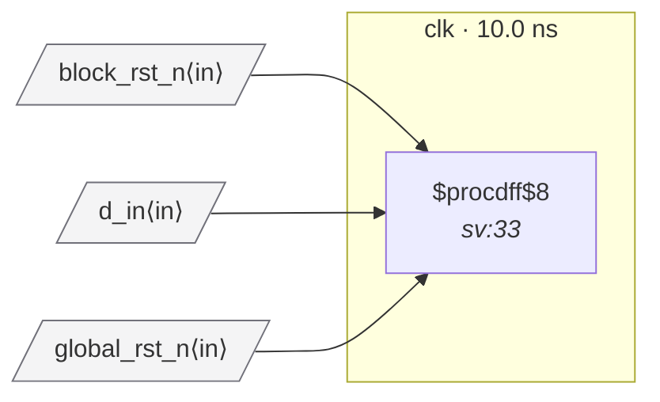

# Fixture: `bad_rdc_005_multi_source_reset`

<!-- generator: scripts/gen_fixture_docs.py -->

Negative-case fixture for RDC-005 — multiple reset sources converging on a flop's reset pin with no explicit muxing.

`combined_rst_n` is the AND of two independent top-level reset ports. Both sources are active simultaneously and the comb has no $mux / control signal selecting which is in effect; the consumer flop will reset on either port falling, with no disambiguation. This is the canonical SoC anti-pattern where `global_rst_n & block_rst_n` is wired into a flop without being registered or routed through a reset-control mux.

Distinct from RDC-004 (which already catches comb-of-flops); RDC-005 fires specifically when the comb fanin is *all top-level reset ports* and no flops — RDC-004 explicitly skips that case to keep the noise floor low on legitimate external-AND patterns, so RDC-005 owns the call.

RDC-005 must fire once on `q_out`; no other rule should fire (single clock, both polarities active-low, comb fanin has no flops so RDC-004 silent).

- **Status:** negative — analyzer must report a violation
- **Top module:** `bad_rdc_005_multi_source_reset`
- **Clocks:** `clk` (10.0 ns)
- **Crossings:** 0 structural (0 async-per-SDC, 0 sync)

## Clock-domain map

## Files

- `bad_rdc_005_multi_source_reset.json`
- `bad_rdc_005_multi_source_reset.sdc`
- `bad_rdc_005_multi_source_reset.sv`

---
*Generated by `scripts/gen_fixture_docs.py` — re-run after editing the SV/SDC/netlist.*
