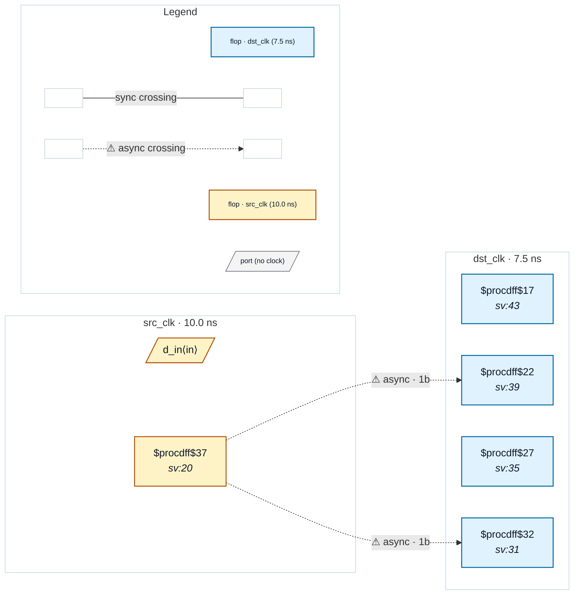

# Fixture: `bad_reconvergent_sync`

<!-- generator: scripts/gen_fixture_docs.py -->

Negative-case fixture: reconvergent synchronizers.

A single source-domain flop fans out to two independent 2FF synchronizer chains in the destination domain. Each chain individually filters metastability, but variable resolution times can produce *different* synchronized values for one or two destination cycles. The downstream combinational reduction across the two chains can therefore observe an illegal combined state that never existed at the source. Should trip CDC-005.

- **Status:** negative — analyzer must report a violation
- **Top module:** `bad_reconvergent_sync`
- **Clocks:** `dst_clk` (7.5 ns), `src_clk` (10.0 ns)
- **Crossings:** 2 structural (2 async-per-SDC, 0 sync)

## Clock-domain map

## Files

- `bad_reconvergent_sync.json`
- `bad_reconvergent_sync.sdc`
- `bad_reconvergent_sync.sv`

---
*Generated by `scripts/gen_fixture_docs.py` — re-run after editing the SV/SDC/netlist.*
