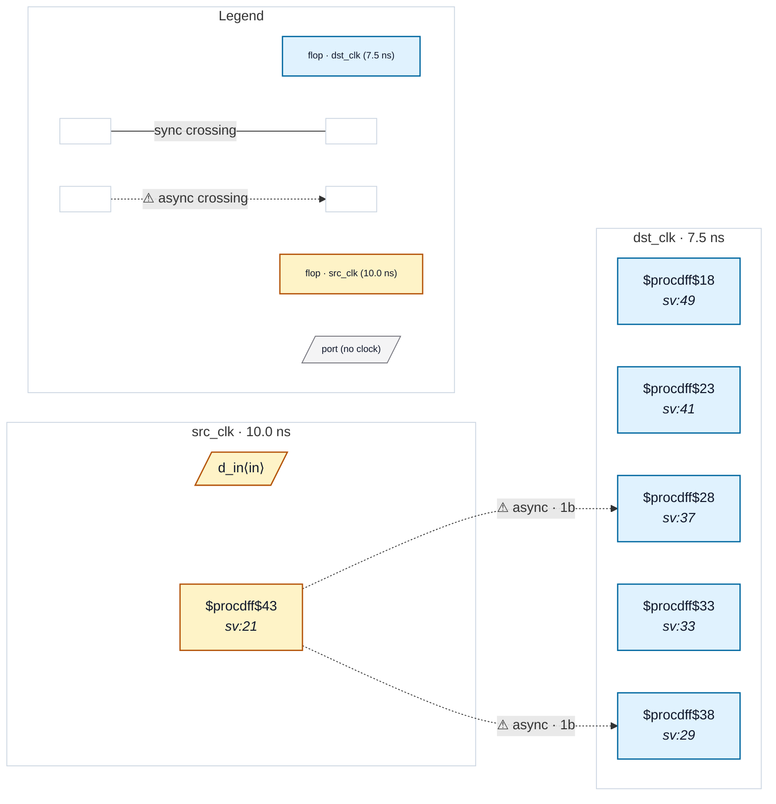

# Fixture: `bad_reconvergent_with_recombine`

<!-- generator: scripts/gen_fixture_docs.py -->

Negative-case fixture: two synchronizer chains whose Qs recombine in a downstream register via an OR reduction.

Stronger version of bad_reconvergent_sync.sv — instead of driving an unregistered output port, the two synchronized values are combined and registered. Phase 2 of CDC-005 (issue #33)'s reconvergence filter must still fire on this shape: a flop that observes both synchronized values is a textbook recombination point, with the same mismatched-resolution failure mode the rule catches.

- **Status:** negative — analyzer must report a violation
- **Top module:** `bad_reconvergent_with_recombine`
- **Clocks:** `dst_clk` (7.5 ns), `src_clk` (10.0 ns)
- **Crossings:** 2 structural (2 async-per-SDC, 0 sync)

## Clock-domain map

## Files

- `bad_reconvergent_with_recombine.json`
- `bad_reconvergent_with_recombine.sdc`
- `bad_reconvergent_with_recombine.sv`

---
*Generated by `scripts/gen_fixture_docs.py` — re-run after editing the SV/SDC/netlist.*
