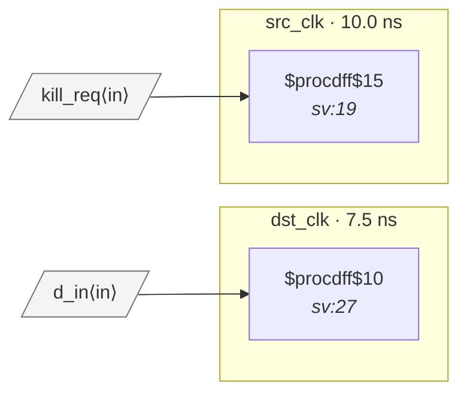

# Fixture: `bad_reset_crossing`

<!-- generator: scripts/gen_fixture_docs.py -->

Negative-case fixture: an async-reset signal generated by a flop in the source clock domain is wired directly into the asynchronous reset pin of a flop in a different clock domain. The reset is asserted immediately but its deassertion edge is unrelated to dst_clk, so dst_q's recovery may violate timing and corrupt the flop. Should trip CDC-007.

- **Status:** negative — analyzer must report a violation
- **Top module:** `bad_reset_crossing`
- **Clocks:** `dst_clk` (7.5 ns), `src_clk` (10.0 ns)
- **Crossings:** 0 structural (0 async-per-SDC, 0 sync)

## Clock-domain map

## Files

- `bad_reset_crossing.json`
- `bad_reset_crossing.sdc`
- `bad_reset_crossing.sv`

---
*Generated by `scripts/gen_fixture_docs.py` — re-run after editing the SV/SDC/netlist.*
