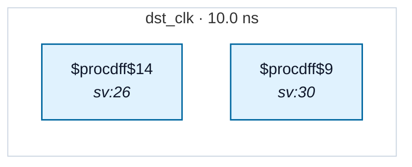

# Fixture: `bad_reset_sync_deassert_polarity`

<!-- generator: scripts/gen_fixture_docs.py -->

Negative-case fixture for RDC-007.

A reset-synchroniser chain whose head D is tied to the *asserted* polarity instead of the deasserted one. The chain is structurally well-formed by every other check (constant-fed head, same-domain Q→D walk, shared async reset, ≥2 flops) so `find_reset_synchronizers` accepts it — but its tail's Q reloads the asserted value (1'b0) on every deassertion edge, so the synchronised reset never propagates "out of reset" to downstream consumers.

RDC-007 must fire exactly once (on the chain tail). Other RDC rules must stay silent — the chain head's reset is a top-level port and there's no other domain in the design.

- **Status:** negative — analyzer must report a violation
- **Top module:** `bad_reset_sync_deassert_polarity`
- **Clocks:** `dst_clk` (10.0 ns)
- **Crossings:** 0 structural (0 async-per-SDC, 0 sync)

## Clock-domain map

## Files

- `bad_reset_sync_deassert_polarity.json`
- `bad_reset_sync_deassert_polarity.sdc`
- `bad_reset_sync_deassert_polarity.sv`

---
*Generated by `scripts/gen_fixture_docs.py` — re-run after editing the SV/SDC/netlist.*
