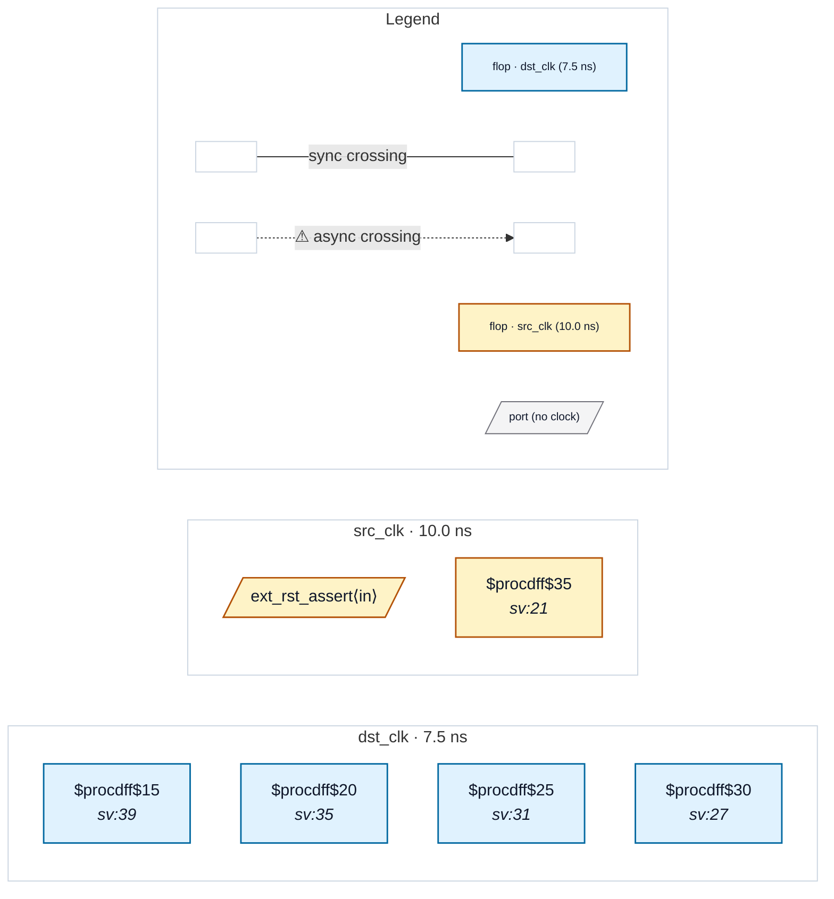

# Fixture: `bad_reset_tree`

<!-- generator: scripts/gen_fixture_docs.py -->

Negative-case fixture: a single async-reset source flop in src_clk fans out to FOUR flops' ARST pins in dst_clk, with no reset synchronizer in between. The grouped CDC-007 should fire ONCE for this shared source (not four times) and list all four destinations in the message — matching how a reset distribution tree is reviewed in practice.

- **Status:** negative — analyzer must report a violation
- **Top module:** `bad_reset_tree`
- **Clocks:** `dst_clk` (7.5 ns), `src_clk` (10.0 ns)
- **Crossings:** 0 structural (0 async-per-SDC, 0 sync)

## Clock-domain map

## Files

- `bad_reset_tree.json`
- `bad_reset_tree.sdc`
- `bad_reset_tree.sv`

---
*Generated by `scripts/gen_fixture_docs.py` — re-run after editing the SV/SDC/netlist.*
