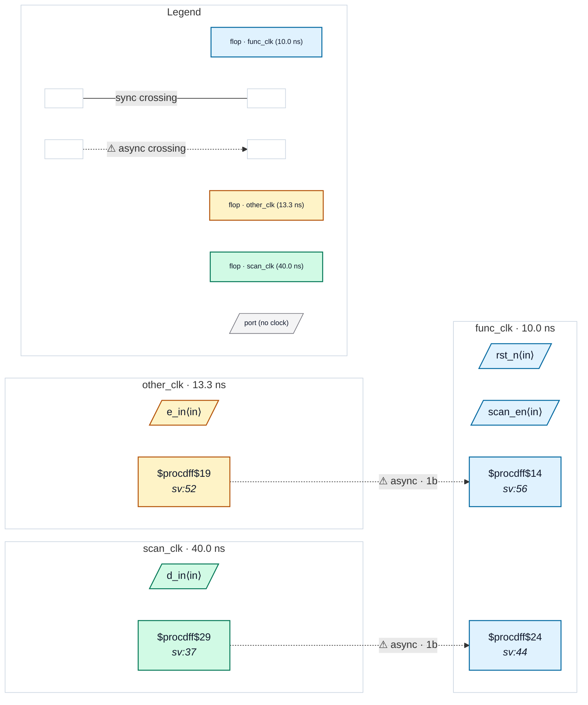

# Fixture: `bad_scan_mode_functional_crossing`

<!-- generator: scripts/gen_fixture_docs.py -->

`--ignore-scan-mode` control case (issue #45) — the flag must not become a blanket "stop checking this design".

Same DFT scan clock mux as `good_scan_mode_ignored` (`$mux(S=scan_en, A=func_clk, B=scan_clk)` in front of `dst_q`), so the scan-path crossing is suppressible. Alongside it sits a second, entirely functional crossing that has nothing to do with DFT: `other_q` in the `other_clk` domain feeds `func_q`, a flop clocked directly by `func_clk` with no mux in its clock network. That flop's CLK fanin contains no scan-mode port, so the crossing is never tagged and never suppressed.

Expected: CDC-001 fires twice without the flag, and once — on the functional path — with it. A tool that reported this design clean under `--ignore-scan-mode` would be hiding a real bug behind a DFT annotation.

```text
Build:
  yosys -p 'read_verilog -sv bad_scan_mode_functional_crossing.sv; \
            hierarchy -top bad_scan_mode_functional_crossing; proc; flatten; \
            write_json bad_scan_mode_functional_crossing.json'
```

- **Status:** negative — analyzer must report a violation
- **Top module:** `bad_scan_mode_functional_crossing`
- **Clocks:** `func_clk` (10.0 ns), `other_clk` (13.3 ns), `scan_clk` (40.0 ns)
- **Crossings:** 2 structural (2 async-per-SDC, 0 sync)

## Clock-domain map



## Files

- `bad_scan_mode_functional_crossing.json`
- `bad_scan_mode_functional_crossing.sdc`
- `bad_scan_mode_functional_crossing.sv`

---
*Generated by `scripts/gen_fixture_docs.py` — re-run after editing the SV/SDC/netlist.*
