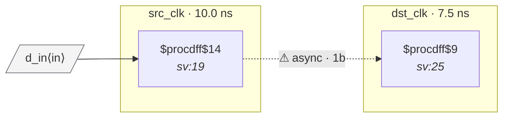

# Fixture: `bad_single_ff_sync`

<!-- generator: scripts/gen_fixture_docs.py -->

Negative-case fixture: a control crossing with only a single destination flop (no second sync stage). Should trip CDC-002.

```text
       src_clk          dst_clk
  ┌──[ src_q ]──────[ dst_q ]──── (no further flop on dst_clk)
  only 1 stage on the destination side → CDC-002
```

- **Status:** negative — analyzer must report a violation
- **Top module:** `bad_single_ff_sync`
- **Clocks:** `dst_clk` (7.5 ns), `src_clk` (10.0 ns)
- **Crossings:** 1 structural (1 async-per-SDC, 0 sync)

## Clock-domain map



## Files

- `bad_single_ff_sync.json`
- `bad_single_ff_sync.sdc`
- `bad_single_ff_sync.sv`

---
*Generated by `scripts/gen_fixture_docs.py` — re-run after editing the SV/SDC/netlist.*
