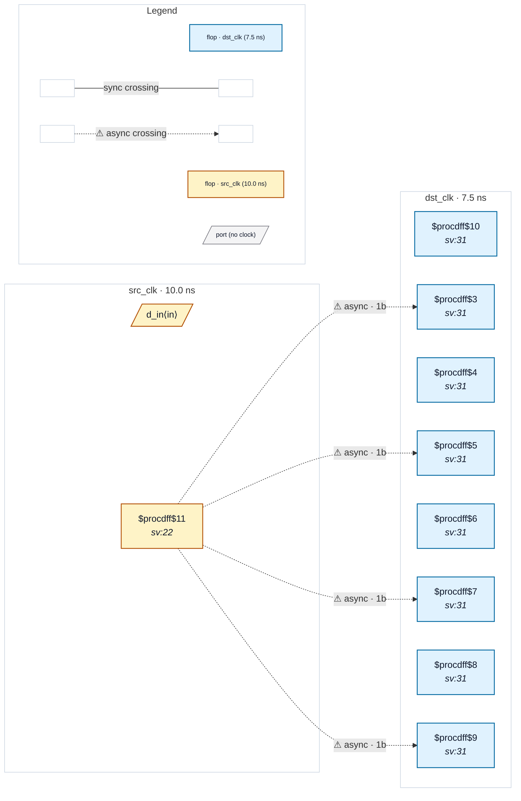

# Fixture: `bad_sliced_bus_reconvergence`

<!-- generator: scripts/gen_fixture_docs.py -->

Negative-case fixture for CDC-020.

A true 4-bit register whose bus is sliced into 1-bit lanes before crossing, with each lane independently 2FF-synced in the destination and recombined back into a 4-bit bus. CDC-004 misses this shape because each per-lane crossing's width is 1 — the multi-bit detector's `width <= 1` skip drops every lane even though the source is genuinely multi-bit.

CDC-020 must fire once on the (src_flop, dst_clock) group. Sister of CDC-019 (shared comb decoder); the failure physics are identical but the source is a true multi-bit register here.

- **Status:** negative — analyzer must report a violation
- **Top module:** `bad_sliced_bus_reconvergence`
- **Clocks:** `dst_clk` (7.5 ns), `src_clk` (10.0 ns)
- **Crossings:** 4 structural (4 async-per-SDC, 0 sync)

## Clock-domain map

## Files

- `bad_sliced_bus_reconvergence.json`
- `bad_sliced_bus_reconvergence.sdc`
- `bad_sliced_bus_reconvergence.sv`

---
*Generated by `scripts/gen_fixture_docs.py` — re-run after editing the SV/SDC/netlist.*
