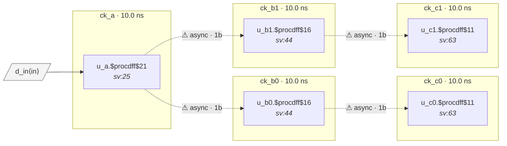

# Fixture: `bad_source_sync_chain`

<!-- generator: scripts/gen_fixture_docs.py -->

Negative fixture: same source-synchronous topology as good_source_sync_chain (block_a / block_b / block_c with clk_in + clk_out clock-buffer ports), but paired with an SDC that fails to declare the per-link clocks as related at the system level.

```text
    A ──► B0 ──► C0
     └──► B1 ──► C1
```

All four links are direct flop-to-flop captures (correct for source-sync timing — no synchronizer expected). When the system SDC declares every clock independent and groups them all asynchronous — the integration mistake of concatenating block- level SDCs without reconciliation — the analyzer correctly reports CDC-001 on each of the four links. The fix is the SDC shape used by ``good_source_sync_chain``.

- **Status:** negative — analyzer must report a violation
- **Top module:** `bad_source_sync_chain`
- **Clocks:** `ck_a` (10.0 ns), `ck_b0` (10.0 ns), `ck_b1` (10.0 ns), `ck_c0` (10.0 ns), `ck_c1` (10.0 ns)
- **Crossings:** 4 structural (4 async-per-SDC, 0 sync)

## Clock-domain map



## Files

- `bad_source_sync_chain.json`
- `bad_source_sync_chain.sdc`
- `bad_source_sync_chain.sv`

---
*Generated by `scripts/gen_fixture_docs.py` — re-run after editing the SV/SDC/netlist.*
