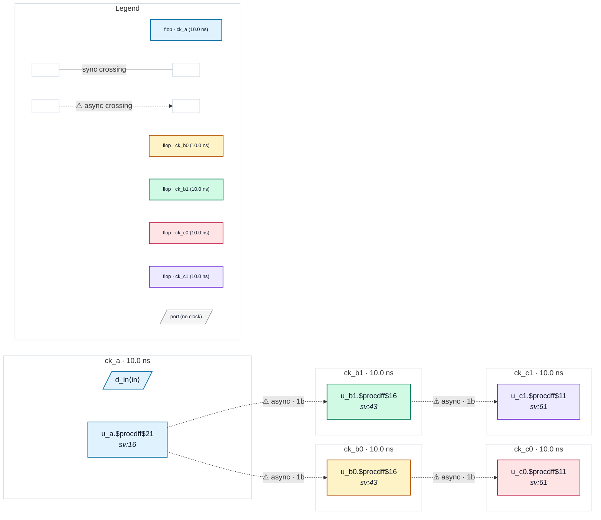

# Fixture: `bad_source_sync_internal`

<!-- generator: scripts/gen_fixture_docs.py -->

Negative fixture: source-synchronous chain wired *internally*. The system SDC declares each forwarded clock async to its master via ``set_clock_groups -asynchronous``, overriding the create_generated_ clock master relationship. The analyzer must fire CDC-001 on each of the four source-sync links (A→B0, A→B1, B0→C0, B1→C1).

- **Status:** negative — analyzer must report a violation
- **Top module:** `bad_source_sync_internal`
- **Clocks:** `ck_a` (10.0 ns), `ck_b0` (10.0 ns), `ck_b1` (10.0 ns), `ck_c0` (10.0 ns), `ck_c1` (10.0 ns)
- **Crossings:** 4 structural (4 async-per-SDC, 0 sync)

## Clock-domain map

## Files

- `bad_source_sync_internal.json`
- `bad_source_sync_internal.sdc`
- `bad_source_sync_internal.sv`

---
*Generated by `scripts/gen_fixture_docs.py` — re-run after editing the SV/SDC/netlist.*
