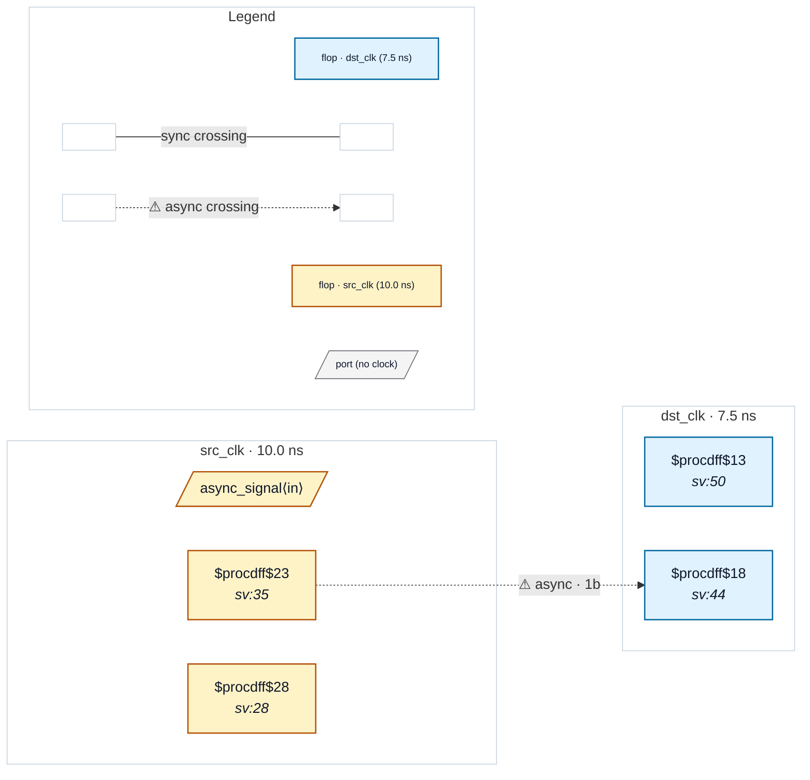

# Fixture: `bad_sync_chain_foreign_reset`

<!-- generator: scripts/gen_fixture_docs.py -->

Negative-case fixture for CDC-015 (issue #172): a 2FF sync chain in `dst_clk` whose ARST is driven by a reset signal *registered in src_clk*. The chain's resolving flops are released asynchronously to dst_clk every time the foreign reset deasserts, so the chain cannot reach steady state on its own clock — exactly the synchroniser-reset-asynchrony failure mode CDC-015 targets.

CDC-001 / CDC-002 see a structurally valid 2FF chain at depth 2 and stay silent — the failure is in the chain's reset path, not its data path. RDC-001 fires independently on each sync flop's ARST (foreign-domain reset source). The two findings coexist; CDC-015's framing tells the user the fix is "use dst_clk's reset for the chain", not "add a reset synchroniser to the reset path".

- **Status:** negative — analyzer must report a violation
- **Top module:** `bad_sync_chain_foreign_reset`
- **Clocks:** `dst_clk` (7.5 ns), `src_clk` (10.0 ns)
- **Crossings:** 1 structural (1 async-per-SDC, 0 sync)

## Clock-domain map

## Files

- `bad_sync_chain_foreign_reset.json`
- `bad_sync_chain_foreign_reset.sdc`
- `bad_sync_chain_foreign_reset.sv`

---
*Generated by `scripts/gen_fixture_docs.py` — re-run after editing the SV/SDC/netlist.*
