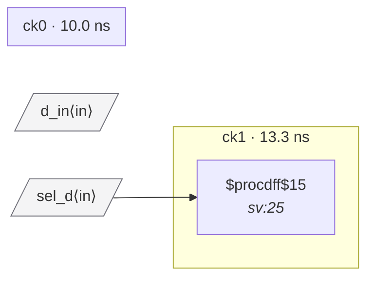

# Fixture: `bad_techmap_async_clock_mux`

<!-- generator: scripts/gen_fixture_docs.py -->

CDC-010 phase-3 fixture: the same clock-mux failure as ``bad_async_clock_mux``, but built with ``simplemap t:$mux`` applied at fixture-build time so the high-level ``$mux`` lowers to a gate-level ``$_MUX_`` cell. Exercises the post-tech-mapping path through ``_control_pins_for`` — the rule must still find the ``$_MUX_.S`` control pin and fire.

The flops stay as ``$adff`` (we don't lower them: ``find_flops`` only recognises the higher-level FF cell types, and dropping them to ``$_DFF_*`` would defeat the test by hiding the foreign-domain source flop from domain assignment).

- **Status:** negative — analyzer must report a violation
- **Top module:** `bad_techmap_async_clock_mux`
- **Clocks:** `ck0` (10.0 ns), `ck1` (13.3 ns)
- **Crossings:** 0 structural (0 async-per-SDC, 0 sync)

## Clock-domain map

## Files

- `bad_techmap_async_clock_mux.json`
- `bad_techmap_async_clock_mux.sdc`
- `bad_techmap_async_clock_mux.sv`

---
*Generated by `scripts/gen_fixture_docs.py` — re-run after editing the SV/SDC/netlist.*
