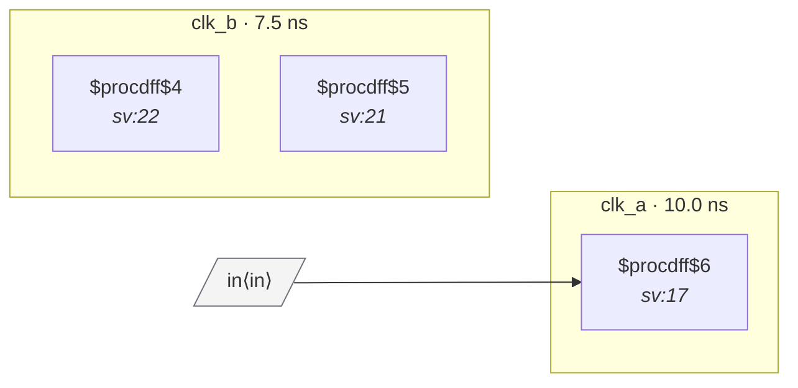

# Fixture: `bad_typed_port_bus_crossing`

<!-- generator: scripts/gen_fixture_docs.py -->

Negative-case fixture: typed top-level bus crossing.

`in[7:0]` is typed to clk_a with set_input_delay, then sampled by a per-bit 2FF vector synchronizer in clk_b. The input typing prevents CDC-011, but it does not prove the bus is coherent when sampled in clk_b. CDC-004 must fire because there is no handshake/gating and no gray-code guarantee.

- **Status:** negative — analyzer must report a violation
- **Top module:** `bad_typed_port_bus_crossing`
- **Clocks:** `clk_a` (10.0 ns), `clk_b` (7.5 ns)
- **Crossings:** 1 structural (1 async-per-SDC, 0 sync)

## Clock-domain map

## Files

- `bad_typed_port_bus_crossing.json`
- `bad_typed_port_bus_crossing.sdc`
- `bad_typed_port_bus_crossing.sv`

---
*Generated by `scripts/gen_fixture_docs.py` — re-run after editing the SV/SDC/netlist.*
