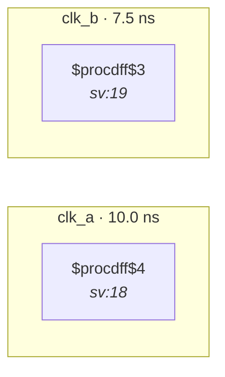

# Fixture: `bad_unconstrained_input_bus_two_domains`

<!-- generator: scripts/gen_fixture_docs.py -->

Negative-case fixture for CDC-011 (#97), multi-bit shape.

8-bit input `in[7:0]` has no `set_input_delay -clock` typing and is captured by flop banks in two distinct clock domains (`clk_a` and `clk_b`). Vector variant of `bad_unconstrained_input_two_domains` — guards against the rule firing per-bit and either deduplicating wrong or missing the bus shape entirely. Expected: one error- severity CDC-011 violation naming both destination clocks.

- **Status:** negative — analyzer must report a violation
- **Top module:** `bad_unconstrained_input_bus_two_domains`
- **Clocks:** `clk_a` (10.0 ns), `clk_b` (7.5 ns)
- **Crossings:** 2 structural (2 async-per-SDC, 0 sync)

## Clock-domain map

## Files

- `bad_unconstrained_input_bus_two_domains.json`
- `bad_unconstrained_input_bus_two_domains.sdc`
- `bad_unconstrained_input_bus_two_domains.sv`

---
*Generated by `scripts/gen_fixture_docs.py` — re-run after editing the SV/SDC/netlist.*
