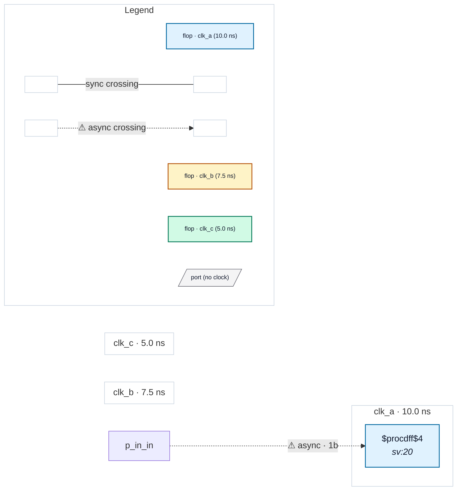

# Fixture: `bad_unconstrained_input_derived_clock`

<!-- generator: scripts/gen_fixture_docs.py -->

Negative-case fixture for CDC-011 (#97).

Input `in` has no `set_input_delay -clock` typing and is captured by a flop whose clock is a combinational function of three declared clocks (`clk_a & clk_b & clk_c`). There's no single declared domain the port could "obviously" belong to — the SDC author has to assert one explicitly. CDC-011 should fire as a warning (single resolved destination domain — whichever one trace_clock_root picks first out of the AND tree).

- **Status:** negative — analyzer must report a violation
- **Top module:** `bad_unconstrained_input_derived_clock`
- **Clocks:** `clk_a` (10.0 ns), `clk_b` (7.5 ns), `clk_c` (5.0 ns)
- **Crossings:** 1 structural (1 async-per-SDC, 0 sync)

## Clock-domain map

## Files

- `bad_unconstrained_input_derived_clock.json`
- `bad_unconstrained_input_derived_clock.sdc`
- `bad_unconstrained_input_derived_clock.sv`

---
*Generated by `scripts/gen_fixture_docs.py` — re-run after editing the SV/SDC/netlist.*
