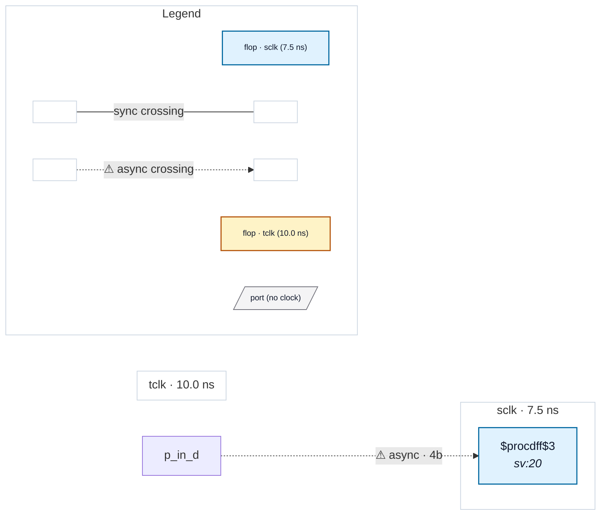

# Fixture: `bad_unconstrained_input_muxed_clock`

<!-- generator: scripts/gen_fixture_docs.py -->

Negative-case fixture for CDC-011 (#97), muxed-clock destination.

4-bit input `d[3:0]` has no `set_input_delay -clock` typing and is captured by a flop whose clock is a test-mode mux between two declared clocks (`tm ? tclk : sclk`). The destination clock isn't a single `create_clock` name, so even a methodologically diligent SDC author couldn't default `d` to one of them. CDC-011 should fire as a warning (single resolved destination domain — whichever side of the mux trace_clock_root picks first).

- **Status:** negative — analyzer must report a violation
- **Top module:** `bad_unconstrained_input_muxed_clock`
- **Clocks:** `sclk` (7.5 ns), `tclk` (10.0 ns)
- **Crossings:** 1 structural (1 async-per-SDC, 0 sync)

## Clock-domain map

## Files

- `bad_unconstrained_input_muxed_clock.json`
- `bad_unconstrained_input_muxed_clock.sdc`
- `bad_unconstrained_input_muxed_clock.sv`

---
*Generated by `scripts/gen_fixture_docs.py` — re-run after editing the SV/SDC/netlist.*
